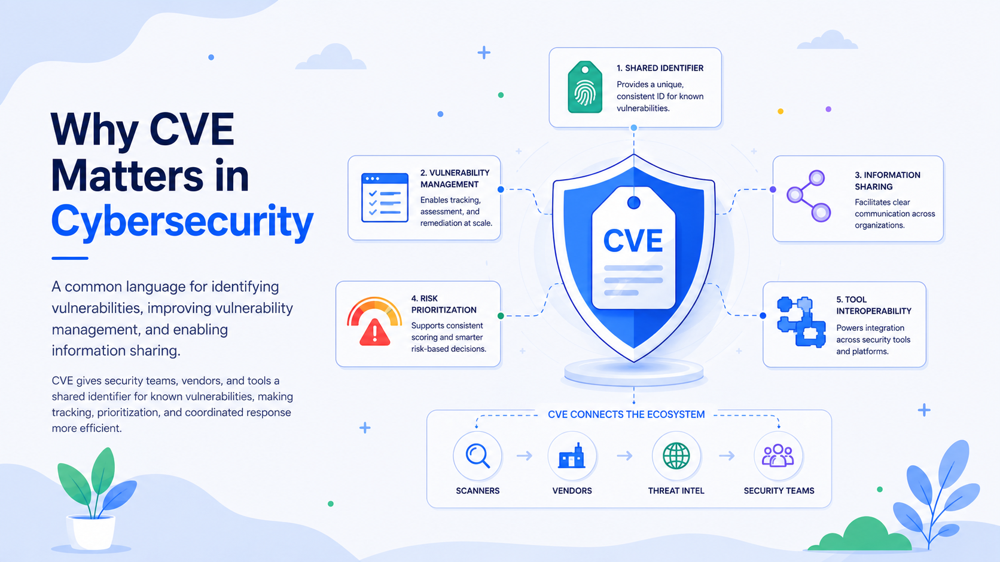

# What Is the Purpose of CVE in Cybersecurity?

Modern organizations depend on thousands of software components, cloud services, operating systems, libraries, devices, and embedded systems. When a security flaw is discovered, researchers, vendors, security teams, regulators, and software tools need a reliable way to refer to the same issue. The Common Vulnerabilities and Exposures program—CVE—provides that reference system.

The CVE Program’s mission is to identify, define, and catalog publicly disclosed cybersecurity vulnerabilities. Each accepted vulnerability receives a standardized identifier, such as `CVE-2025-12345`, and a CVE Record with a concise description and supporting references. The identifier is not a scanner, severity score, exploit report, or patch. Its main purpose is more fundamental: it gives the security community a shared name for a specific vulnerability.

## CVE as a Common Language

Without standardized identifiers, the same flaw may be described differently by a vendor, researcher, incident-response team, and security-product supplier. One source may call it a “remote code-execution issue,” another may use a vendor advisory number, and a third may mention only the affected component. It can be difficult to tell whether these descriptions concern one defect or several different problems.

A CVE ID reduces that ambiguity. When a patch bulletin, detection signature, scanner, asset system, threat report, or incident ticket cites the same ID, people and tools can correlate their information with greater confidence. CVE therefore acts as a normalization layer across the cybersecurity ecosystem.

A CVE ID contains the `CVE` prefix, a year, and a unique sequence number. The year is part of the identifier; it does not necessarily show when exploitation began, when a patch was released, or when an organization became exposed.

## What a CVE Record Contains

A published CVE Record establishes a vulnerability’s identity and distinguishes it from other issues. It may include the affected product and versions, a technical description, advisory or patch references, weakness classifications, severity information, and other structured fields. Records can be updated as new or corrected information becomes available. Official data is distributed through the CVE website, APIs, and bulk-download files.

An assigned ID does not always have immediate public details. It begins in a reserved state and can be published after the responsible organization supplies the required information. A record may be rejected if the ID was assigned in error, duplicates another record, or should no longer represent a vulnerability.

## Who Assigns CVE IDs?

CVE is a federated program. Authorized organizations called CVE Numbering Authorities, or CNAs, assign IDs and publish records within defined scopes. CNAs include vendors, open-source projects, research organizations, bug-bounty providers, and coordination centers. This puts assignment near organizations with access to engineering details, affected-version information, disclosure schedules, and remediation guidance. Program rules and Root organizations coordinate the CNA hierarchy.

## How CVE Supports Vulnerability Management

Vulnerability management is the continuous process of finding weaknesses, identifying affected assets, assessing risk, assigning remediation, verifying fixes, and reporting results. CVE supports nearly every stage.

### Discovery and Asset Correlation

Scanners commonly report findings by CVE ID. Teams can map them to an asset inventory, software bill of materials, cloud workload, endpoint platform, or configuration-management database. The identifier allows tools to exchange findings without relying only on free-text descriptions.

Suppose a scanner detects an outdated library on 300 systems, a software-composition platform finds it in 20 applications, and a threat feed reports exploitation of its flaw. If every source uses the same CVE ID, the organization can combine the evidence into one remediation campaign rather than treating it as three unrelated issues.

### Enrichment and Technical Assessment

CVE establishes the vulnerability’s identity, while downstream databases add context. The U.S. National Vulnerability Database, or NVD, analyzes published CVEs and associates them with structured data such as product applicability, weakness categories, references, and impact metrics. NIST describes the NVD as a standards-based repository supporting automation, security measurement, and compliance.

CVE and NVD are related but not interchangeable. CVE answers, “Which vulnerability are we discussing?” Enrichment sources help answer, “How does it work, which products may be affected, and how severe could it be?”

### Risk-Based Prioritization

A CVE ID alone is not a remediation priority. Organizations should combine it with severity, exploitability, active exploitation, asset exposure, business criticality, compensating controls, and the likely consequences of compromise.

A high-severity flaw on an isolated test system may present less immediate risk than a medium-severity flaw being actively exploited on an internet-facing identity server. CISA’s Known Exploited Vulnerabilities Catalog uses CVE IDs to identify vulnerabilities with evidence of exploitation in the wild, providing an important prioritization input.

CVE enables prioritization without replacing it. It is the join key that lets teams combine severity data, exploit intelligence, vendor guidance, asset context, and remediation status.

### Remediation, Automation, and Reporting

Once prioritized, a CVE ID becomes a durable tracking reference for engineering tickets, patch jobs, change requests, exceptions, incident reports, and dashboards. Vendors can cite the same identifier in release notes and advisories, while auditors can trace a finding from detection through closure.

Machine-readable CVE data supports automation. Organizations can trigger alerts for new records, match affected products to inventories, update detection content, launch patch workflows, and measure remediation performance. The official CVE List is available as structured data generated from CVE Services.

Because the identifier remains stable even when descriptions or assessments change, it provides a consistent anchor for tracking affected assets, remediation time, overdue exceptions, and exposure by business service.

## How CVE Improves Information Sharing

Cybersecurity depends on rapid communication across organizational boundaries. A vendor can publish an advisory linked to a CVE ID; researchers can publish analysis using the same ID; government agencies can issue alerts; security companies can release detection rules; and customers can search their environments for affected products. Even when these parties disagree about severity or urgency, the identifier helps ensure that they are discussing the same vulnerability.

This shared reference reduces duplication. Analysts can correlate differently worded reports and avoid opening separate cases for one issue. Separate CVE IDs can also distinguish flaws in the same product that have different root causes, impacts, or fixes.

CVE supports coordinated disclosure as well. A CNA can reserve an ID before publication so that a vendor advisory, researcher report, patch notice, and defensive guidance can use one identifier when details are released. Reservation does not prove that a vulnerability is valid or reveal its technical details; it prepares a stable reference for the public record.

## What CVE Does Not Do

CVE is essential infrastructure, but it is not a complete risk-management solution. A CVE ID is not a severity rating, and a CVE Record does not prove that every product version in an organization is affected. Asset matching may be complicated by backported patches, vendor packaging, forks, disabled features, configuration differences, and incomplete inventories.

A CVE also does not show whether exploitation is occurring; threat-intelligence sources and resources such as CISA’s KEV Catalog are needed for that determination. The absence of a CVE does not prove that a product is secure. A flaw may be undiscovered, privately reported, awaiting publication, outside the program’s scope, or documented through another mechanism.

Finally, CVE does not replace vendor advisories. Vendors and maintainers are often the authoritative sources for affected versions, patches, mitigations, and operational caveats.

## The Practical Value of CVE

The core value of CVE is interoperability. It creates a stable, globally recognized reference connecting disclosures, vendor advisories, scanners, threat intelligence, asset inventories, ticketing systems, compliance processes, and remediation evidence.

For vulnerability-management teams, that identifier enables a coordinated workflow: identify the vulnerability, determine where it exists, enrich it with risk data, prioritize affected assets, remediate, and verify closure. For the broader security community, it enables faster and less ambiguous sharing of technical information.

CVE does not decide an organization’s risk tolerance or patching order. It provides the shared vocabulary and structured foundation needed to make those decisions consistently, communicate them clearly, and automate them at scale.
