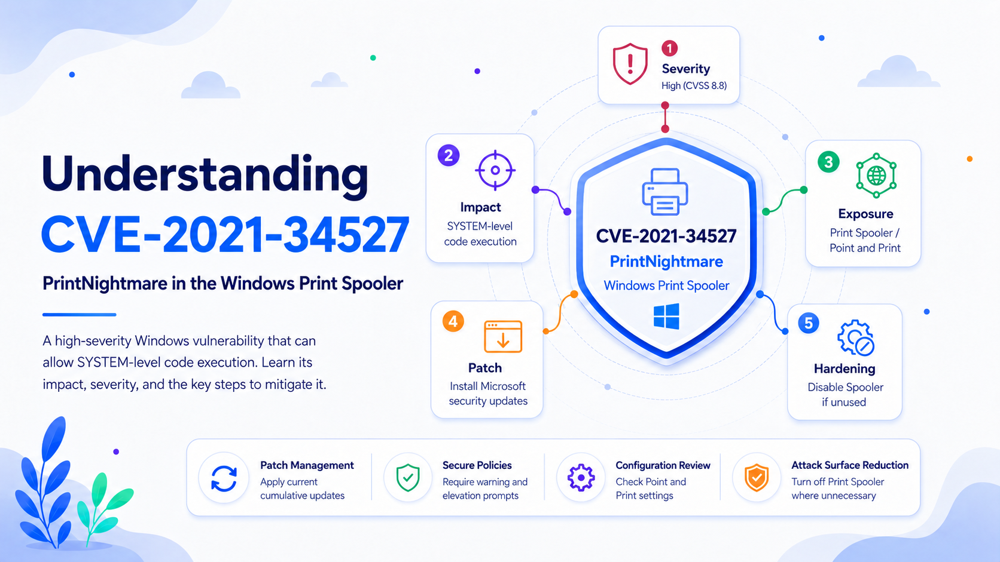

# CVE-2021-34527 Explained: Understanding and Mitigating PrintNightmare

## Executive Summary

CVE-2021-34527, commonly known as **PrintNightmare**, is a remote code execution vulnerability in the Microsoft Windows Print Spooler service. The flaw occurs because the service can perform privileged file operations improperly. A successful attacker can execute arbitrary code with **SYSTEM** privileges—the highest practical privilege level on a Windows host—and may install software, alter or delete data, or create accounts with full administrative rights.

The National Vulnerability Database, or NVD, records a CVSS v3.1 base score of **8.8, High**. It also notes that the vulnerability appears in the Cybersecurity and Infrastructure Security Agency’s Known Exploited Vulnerabilities catalog, confirming exploitation in real environments.

The primary remediation is to install the latest applicable Windows update, verify secure Point and Print settings, and disable the Print Spooler on systems that do not require printing.

## What Is CVE-2021-34527?

Windows uses the Print Spooler service, implemented as `spoolsv.exe`, to queue print jobs, communicate with printers and print servers, and manage printer drivers. Because the service runs with extensive operating-system privileges, it must strictly control which files and drivers it handles.

CVE-2021-34527 represents a failure in that trust boundary. The Print Spooler can be induced to perform privileged operations that lead to attacker-controlled code running as SYSTEM.

Once code runs as SYSTEM, the attacker effectively controls the computer. On a workstation, this can expose credentials and local data. On a server, it can enable persistence, lateral movement, and further compromise of connected systems.

The Print Spooler may also be enabled on servers that have no operational reason to print. This leaves a highly privileged service exposed without providing meaningful business value.

## How Exploitation Works at a High Level

The attack abuses printer-driver installation and related Print Spooler operations rather than a normal document-printing workflow. An attacker with low-level access can attempt to make the privileged service load attacker-controlled code.

Because the Print Spooler runs as SYSTEM, successfully loading that code converts limited access into full control of the host. The CVSS vector reflects this combination of network reachability, low attack complexity, low required privileges, and no required user interaction.

This distinction matters operationally. Endpoint protections focused only on malicious documents, email attachments, or user clicks do not address the root cause. Defenders must remediate the service itself, its update level, and the policies governing printer-driver installation.

## Severity and Attack Characteristics

The NVD entry displays Microsoft’s CVSS v3.1 assessment:

**CVSS score: 8.8 — High**

**Vector:** `CVSS:3.1/AV:N/AC:L/PR:L/UI:N/S:U/C:H/I:H/A:H`

Each element of the vector explains part of the risk:

* **AV:N — Network:** Exploitation can occur across a network.
* **AC:L — Low complexity:** The attack does not depend on unusually difficult conditions.
* **PR:L — Low privileges:** Some existing access is required, but administrative rights are not.
* **UI:N — No user interaction:** A victim does not need to open a file, click a link, or approve a prompt.
* **S:U — Scope unchanged:** The vulnerable component and the impacted security authority remain within the same security scope.
* **C:H/I:H/A:H — High impact:** Confidentiality, integrity, and availability can all be severely affected.

CVSS does not capture every business factor. Asset role, network accessibility, stored credentials, administrative relationships, and the ability to reach other systems should influence remediation priority.

The NVD also records CVE-2021-34527 in CISA’s Known Exploited Vulnerabilities catalog. It was added on November 3, 2021, with the required action to apply vendor updates. This establishes that the vulnerability is not merely theoretical.

## Impact of Successful Exploitation

According to the NVD description, an attacker who successfully exploits the vulnerability may install programs; view, change, or delete data; and create new accounts with full user rights.

In an enterprise environment, this can lead to:

* Complete compromise of the affected Windows host
* Credential theft
* Persistent administrative access
* Installation of malicious services or printer drivers
* Modification or deletion of business data
* Disabling or bypassing security controls
* Lateral movement to other systems
* Interruption of printing and other business operations

Risk increases when Point and Print settings have been modified to suppress warnings or elevation prompts. Microsoft’s investigation found that reported bypasses of the out-of-band update depended on changing default Point and Print registry settings to an insecure configuration.

CVE-2021-34527 affected multiple Windows client and server generations. Exposure depends on the Windows release, build number, installed updates, Print Spooler state, and policy configuration. Administrators should use the NVD and Microsoft Security Update Guide records to map each device to its applicable update rather than relying on a single static product list.

## Recommended Remediation

### 1. Install Current Windows Security Updates

Microsoft released out-of-band security updates on July 6 and July 7, 2021, to address the vulnerability across supported Windows versions. The packages were cumulative and included earlier security fixes.

On systems maintained today, administrators should install the latest applicable cumulative Windows security update. Current cumulative updates supersede the original 2021 packages and include previously released security corrections.

Print servers and other high-value systems should receive priority. Unsupported Windows versions should be upgraded, isolated, or retired rather than protected indefinitely through temporary workarounds.

### 2. Verify Point and Print Registry Settings

Patching alone is not sufficient when legacy policy settings weaken the protection.

Microsoft states that the following values under this registry path must be set to `0` or remain undefined:

`HKEY_LOCAL_MACHINE\SOFTWARE\Policies\Microsoft\Windows NT\Printers\PointAndPrint`

The relevant values are:

* `NoWarningNoElevationOnInstall`
* `UpdatePromptSettings`

These values are absent by default, which is a secure state. Setting `NoWarningNoElevationOnInstall` to `1` makes the system vulnerable by design. The security update does not automatically correct existing insecure registry values.

Administrators should check these settings through centralized configuration-management tools rather than reviewing machines manually wherever possible.

### 3. Enforce Secure Group Policy

Configure **Point and Print Restrictions** under:

`Computer Configuration > Administrative Templates > Printers`

For both new printer connections and updates to existing connections, select:

**Show warning and elevation prompt**

Apply this policy to machines hosting the Print Spooler and verify that the resulting registry values are set to `0`. Microsoft warns that non-zero values can leave an updated device vulnerable.

Printer-driver installation should also require administrative credentials. Microsoft documents the following registry control:

`RestrictDriverInstallationToAdministrators=1`

Organizations should validate the effective value through Group Policy, endpoint-management systems, or other configuration-management platforms.

### 4. Disable the Print Spooler Where It Is Unnecessary

On domain controllers, infrastructure servers, appliances, and other Windows systems that do not need printing, stop and disable the Print Spooler service.

Disabling the service prevents both local and remote printing, so the operational effect must be assessed. However, it also removes the vulnerable service from the attack surface. CERT/CC documented this as a Microsoft workaround during the initial PrintNightmare response.

Where local printing is required but remote print jobs are not, disable the following policy:

**Allow Print Spooler to accept client connections**

This provides a narrower containment measure than disabling the Print Spooler completely.

### 5. Validate the Effective Configuration

A complete remediation program should confirm that:

* The latest applicable Windows cumulative update is installed.
* The Print Spooler is disabled on systems that do not require printing.
* Point and Print registry values are set to `0` or are absent.
* Warning and elevation prompts are enforced.
* Non-administrators cannot install printer drivers on print servers.
* Configuration-management tools are not restoring insecure legacy settings.
* Security monitoring detects unexpected printer-driver installation or Print Spooler configuration changes.

The essential lesson is that “update installed” and “risk removed” are not always equivalent. Microsoft instructed customers to apply the security update in all cases and then review the related registry settings.

## Common Remediation Errors

One common mistake is confirming that an update is installed without reviewing Point and Print configuration. Legacy policies created to simplify printer deployment may suppress warnings and elevation requirements, weakening the protection provided by the patch.

Another mistake is leaving the Print Spooler enabled on every Windows system. Servers that do not print should generally not run a privileged printing service.

Organizations may also validate remediation only by looking for an original 2021 update identifier. Because Windows updates are cumulative, a newer package may contain the fix even when the original update is not listed separately. Validation should consider the installed operating-system build, current patch level, service state, registry configuration, and effective Group Policy.

## Final Assessment

CVE-2021-34527 is a high-severity Windows Print Spooler vulnerability that can give an attacker SYSTEM-level control. Its CVSS v3.1 score of 8.8 reflects network reachability, low attack complexity, low required privileges, no user interaction, and high impact to confidentiality, integrity, and availability.

Its inclusion in CISA’s Known Exploited Vulnerabilities catalog further supports urgent remediation.

Mitigation requires current Windows updates, secure Point and Print values, enforced elevation prompts, administrator-only printer-driver installation, and disabling the Print Spooler where it is unnecessary.

Organizations should then validate the resulting configuration across the entire Windows fleet. Patching, policy correction, attack-surface reduction, and technical verification provide the strongest protection when applied together.
