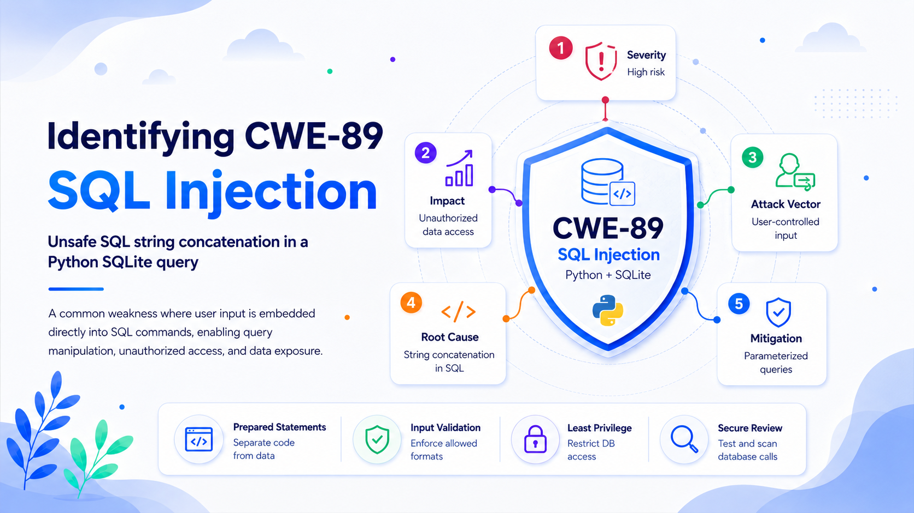

# Identifying and Classifying CWEs in a Python SQLite Query

The following Python function appears to be a simple database lookup, but it creates a direct path from untrusted input to executable SQL:

```python
import sqlite3

def get_user(username):
    conn = sqlite3.connect("users.db")
    cursor = conn.cursor()
    query = "SELECT * FROM users WHERE username='" + username + "';"
    cursor.execute(query)
    user = cursor.fetchone()
    conn.close()
    return user
```

The intended operation is to retrieve the row whose `username` matches the supplied value. The implementation instead combines the value and the SQL command into one string. If an attacker can influence `username`, SQLite may interpret parts of that value as SQL syntax rather than ordinary data.

## Primary Finding: CWE-89 — SQL Injection

The most precise classification is **CWE-89: Improper Neutralization of Special Elements used in an SQL Command (“SQL Injection”)**. MITRE defines this weakness as constructing an SQL command from externally influenced input without correctly neutralizing elements that can alter the intended statement. CWE-89 is a **Base-level weakness**, making it an appropriate root-cause classification for this code.

The vulnerable flow is direct:

1. `username` enters the function from a potentially untrusted source.
2. String concatenation inserts it into the SQL statement.
3. `cursor.execute()` sends the complete text to SQLite.
4. SQLite parses attacker-controlled characters as query syntax.

An attacker could supply:

```text
' OR 1=1 --
```

The resulting statement would be equivalent to:

```sql
SELECT * FROM users WHERE username='' OR 1=1 --';
```

The injected quote ends the intended string literal, `OR 1=1` makes the predicate true, and the comment marker suppresses the remaining quote. Python’s official `sqlite3` documentation demonstrates the same attack class and warns that assembling SQL with string operations is vulnerable to injection.

The call to `fetchone()` does not mitigate the weakness. It only limits how many matching rows Python consumes. A manipulated query may still return an administrator or another unintended account.

## CWE Taxonomy and Related IDs

The vulnerability should be recorded primarily as **CWE-89**.

Within MITRE’s taxonomy, CWE-89 is a child of **CWE-943: Improper Neutralization of Special Elements in Data Query Logic**. It also falls under the broader **CWE-74: Improper Neutralization of Special Elements in Output Used by a Downstream Component (“Injection”)**. These are parent classifications, not separate defects. Reporting all three as independent findings would overstate the result.

**CWE-20: Improper Input Validation** may be a contributing weakness if the application defines username constraints—such as a maximum length or allowed-character policy—and fails to enforce them. MITRE defines CWE-20 as failing to validate properties required for safe and correct input processing. It is not the best primary mapping because validation alone does not reliably prevent SQL injection. The root cause is the failure to separate SQL code from data.

| Role                 | CWE        | Assessment                                     |
| -------------------- | ---------- | ---------------------------------------------- |
| Primary weakness     | **CWE-89** | Confirmed SQL injection                        |
| Taxonomic parent     | CWE-943    | Broader data-query injection class             |
| General parent       | CWE-74     | Broader injection class                        |
| Possible contributor | CWE-20     | Only if required username validation is absent |

## Security Implications and Attack Scenarios

### Unauthorized Access and Identity Confusion

A Boolean payload such as `OR 1=1` can alter the `WHERE` clause so it matches records other than the requested user. Since `fetchone()` returns one matching row, the function may pass an unintended account to downstream code.

The impact depends on the caller. If the result is used for authentication, session creation, password reset, billing, profile access, or authorization, the weakness may lead to account takeover or privilege escalation. In a multi-tenant application, similar manipulation may weaken organization or ownership filters and expose another customer’s records. MITRE lists reading application data and bypassing authentication or other protection mechanisms among the consequences of CWE-89.

This snippet alone does not prove a complete authentication bypass because the surrounding logic is unknown. It does provide a query-manipulation primitive capable of undermining later security decisions.

### Sensitive-Data Disclosure

An attacker may attempt subqueries or `UNION SELECT` clauses to retrieve data from other tables. Success depends on the schema and how results are exposed. Potential targets include email addresses, password hashes, reset tokens, API keys, and role flags. Even a Boolean response can support blind extraction when repeated inputs reveal whether guessed conditions are true.

### Data Modification and Destruction

A classic SQL-injection example uses:

```text
'; DROP TABLE users; --
```

For this exact code, that scenario requires qualification. Current Python documentation states that `sqlite3.Cursor.execute()` executes one SQL statement and raises `ProgrammingError` when more than one statement is supplied. A stacked second statement is therefore not the most likely exploit against this function.

The restriction does not eliminate SQL injection. Attackers can still alter the existing `SELECT` through Boolean logic, comments, functions, subqueries, or unions. The same unsafe pattern becomes directly destructive if reused in an `UPDATE`, `DELETE`, or `INSERT`, or if an API allowing multiple statements is later used. MITRE includes modification and deletion of application data among potential CWE-89 impacts.

## Correct Remediation: Parameterized Queries

The required fix is to keep SQL syntax constant and pass `username` separately as a bound value:

```python
import sqlite3

def get_user(username):
    with sqlite3.connect("users.db") as conn:
        cursor = conn.execute(
            "SELECT * FROM users WHERE username = ?",
            (username,),
        )
        return cursor.fetchone()
```

The `?` is a placeholder. The statement and value are supplied separately, so SQLite treats the username as data even when it contains quotes, comment markers, or SQL keywords. Python’s documentation recommends placeholders instead of string formatting and supports both question-mark and named styles. MITRE likewise recommends prepared statements or parameterized queries because they enforce separation between code and data.

The comma in `(username,)` matters because it creates a one-element tuple. Without it, `(username)` is simply the original string.

A named parameter is equally valid:

```python
cursor.execute(
    "SELECT * FROM users WHERE username = :username",
    {"username": username},
)
```

F-strings, `%` formatting, `str.format()`, and manual quote escaping do not provide equivalent protection because they still produce one attacker-influenced SQL string.

## Defense-in-Depth Controls

Parameterization is the primary control. Additional measures reduce exposure and improve maintainability.

**Validate business rules.** Enforce the expected type, length, and legitimate username syntax. Validation should define accepted input rather than search for every possible attack string. MITRE recommends allowlist-oriented validation and warns against relying only on malicious-input detection.

**Minimize exposed data.** Replace `SELECT *` with explicit columns such as `id`, `username`, and `display_name`. Add a `UNIQUE` constraint if usernames must be unique.

**Apply least privilege.** Restrict permissions on the SQLite file and directory. Least privilege does not prevent injection, but it limits potential damage.

**Handle errors, test, and scan.** Return generic failures to remote clients, protect detailed logs, and test that apostrophes and SQL-like strings are treated as literal usernames. Static analysis should flag database calls fed by concatenation or interpolation.

## Hardened Implementation

```python
import sqlite3

def get_user(username):
    if not isinstance(username, str):
        raise TypeError("username must be a string")
    if not 1 <= len(username) <= 64:
        raise ValueError("invalid username length")

    with sqlite3.connect("users.db") as conn:
        conn.row_factory = sqlite3.Row
        row = conn.execute(
            """
            SELECT id, username, display_name
            FROM users
            WHERE username = ?
            """,
            (username,),
        ).fetchone()

    return dict(row) if row is not None else None
```

The length limit is an example and must match the application’s real identity rules. The essential invariant is constant: externally influenced values must never be concatenated into SQL command text.

## Conclusion

The code contains a confirmed **CWE-89 SQL Injection** weakness. CWE-943 and CWE-74 are relevant parent entries, while CWE-20 is only a possible contributing weakness where defined username constraints are absent. The vulnerability can enable unauthorized record selection, confidential-data exposure, authentication or authorization bypass, blind extraction, and—in related write queries—data modification or deletion.

The correct remediation is structural: use parameterized queries, validate legitimate business constraints, limit selected data and privileges, suppress detailed client-facing errors, and test every database call that handles externally influenced input. MITRE ranked CWE-89 second in its 2025 CWE Top 25, underscoring its continuing prevalence and impact.
