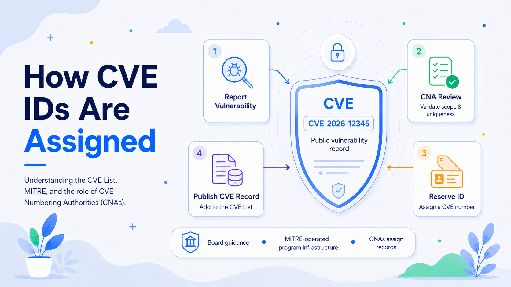

# How CVE IDs Are Assigned—and Who Maintains the CVE List

Modern vulnerability management depends on shared identifiers. A vendor advisory, scanner, incident report, and patching platform may describe the same flaw differently, but a Common Vulnerabilities and Exposures identifier gives them a common reference. The CVE Program identifies, defines, and catalogs publicly disclosed cybersecurity vulnerabilities, and the CVE List is its authoritative catalog of CVE Records.

A CVE ID is not a severity score, proof of exploitation, or a promise that a patch exists. It is a stable name for a vulnerability. Its format is `CVE-YYYY-NNNN`, with a sequence portion of at least four digits that can grow longer. The year follows CVE assignment rules and should not be treated as a dependable discovery date.

## From Vulnerability Report to CVE Record

### 1. A Potential Vulnerability Is Reported

The process begins when a researcher, supplier, security team, coordinator, or other party identifies behavior that may qualify as a vulnerability. The issue may remain private while the reporter and supplier investigate it, develop a fix, and coordinate disclosure.

The requester should contact the CVE Numbering Authority whose scope best matches the affected product or service. This is often the vendor, open-source project, hosted-service provider, CERT, or disclosure coordinator responsible for the technology. Anyone can request a CVE ID, but the request should go to the appropriate authority rather than several CNAs at once.

### 2. The CNA Evaluates Scope and Validity

A CVE Numbering Authority, or CNA, is authorized to assign CVE IDs and publish corresponding CVE Records within an approved scope. CNAs include product suppliers, open-source foundations, CERTs, research organizations, bug-bounty providers, hosted-service operators, and industry consortiums.

Scope is fundamental. A supplier CNA may cover its own products, while another CNA may cover a sector, regional community, coordinated-disclosure service, or specific technology area. Keeping assignment close to the relevant domain gives the CNA access to product expertise, affected-version data, remediation plans, and disclosure channels.

The CNA assesses whether the behavior meets the CVE Program’s vulnerability definition. It may reproduce the issue, consult the supplier, clarify affected versions, examine whether a security boundary is crossed, and search for an existing CVE Record. This is a rules-based determination, not an infallible certification of every technical claim. Disagreements can be escalated through CNAs, Roots, Top-Level Roots, and, for cross-hierarchy matters, the Council of Roots.

### 3. The CNA Decides How Many IDs Are Required

One report does not necessarily equal one CVE ID. It may contain several independently fixable flaws, while several symptoms may come from one underlying defect. CNAs apply counting and abstraction rules to choose the correct granularity.

Independently remediable vulnerabilities tend to receive separate IDs. Multiple manifestations of one shared root cause may be represented by one record, depending on the codebase, affected products, and fix structure. This prevents duplicate records and overly broad entries that conceal distinct remediation work.

### 4. The CNA Reserves and Assigns an ID

After deciding that assignment is appropriate, the CNA reserves an available identifier through CVE Services, which supports ID reservation, record submission, and CNA account management.

The identifier may initially appear as **RESERVED**. This means the number has been allocated but the public record does not yet contain the required vulnerability details. Reserved status supports coordinated disclosure: the identifier can be used in private communications, draft advisories, patches, and release planning before technical information becomes public.

Reservation allocates the identifier to a CNA; assignment associates it with a particular vulnerability. An assigned ID should not be recycled for an unrelated issue.

### 5. The CNA Creates the Record

The ID alone is not the complete entry. The assigning CNA prepares a structured CVE Record. Under the current CVE JSON model, the CNA container includes required information such as the affected product and versions, problem type, prose description, and at least one public reference. It may also include credits, CWE mappings, severity metrics, workarounds, and solution information.

The description should distinguish the flaw from similar issues and identify the affected component, relevant conditions, and security impact. References normally point to vendor advisories, project notices, researcher reports, patches, or other public material.

Disclosure timing is commonly coordinated with the supplier and reporter. Once an assigned CVE ID is publicly disclosed, the CNA rules call for timely publication; CNAs should publish within 72 hours of becoming aware that the identifier is public.

### 6. CVE Services Validates and Publishes It

The CNA submits the record through CVE Services, which checks required structural and format conditions. The published record becomes part of the authoritative CVE List and is distributed through the CVE website, official data services, and the CVE List V5 repository.

Security products and databases ingest the record and may enrich it with scoring, exploit intelligence, platform analysis, or remediation priorities. This is why CVE and the U.S. National Vulnerability Database are related but not identical: CVE supplies the identifier and base record, while NVD and other services may add CVSS scores, classifications, and platform mappings.

### 7. Records Can Be Corrected or Rejected

Publication does not freeze a record. The assigning CNA can correct descriptions, refine affected-version ranges, add references, and update materially incorrect information. Authorized Data Publishers may add separate enrichment containers without replacing the assigning CNA’s original container.

A record can be marked **REJECTED** when the identifier should no longer be used—for example, because it duplicates another CVE, was assigned to a non-vulnerability, or was withdrawn administratively. Rejected records remain visible so consumers can recognize the invalid ID and follow any replacement.

## Who Manages the CVE List?

The CVE List uses distributed governance rather than a single organization performing every function.

The **CVE Board** provides strategic oversight. Its members represent the cybersecurity community and guide policy, operating structure, coverage, data quality, and future development. Core policy documents, including the CNA rules and dispute policy, are governed through Board processes.

The **CVE Program Secretariat**, currently The MITRE Corporation, provides administrative, technical, and logistical support. It maintains program infrastructure and the CVE website, supports the Board and working groups, and helps keep CVE publicly available. MITRE also holds operational roles within the CNA hierarchy.

The program is sponsored by the U.S. Department of Homeland Security’s Cybersecurity and Infrastructure Security Agency, or CISA. Sponsorship, Board governance, Secretariat operations, and vulnerability assignment are separate responsibilities. The claim that “MITRE assigns every CVE” is therefore inaccurate.

**Top-Level Roots and Roots** manage CNA hierarchies. They recruit, train, oversee, and support CNAs, and help resolve scope conflicts, delays, and disputes. Each hierarchy includes a CNA of Last Resort function for vulnerabilities not covered by another CNA’s scope.

## The Role of CNAs

CNAs are the operational engine of the CVE List. Within their approved scope, they receive reports, coordinate with suppliers and researchers, determine whether assignment is appropriate, apply counting rules, check for duplicates, reserve IDs, publish records, maintain those records, and participate in dispute resolution.

This distributed model scales better than sending every vulnerability to one central team. It also places decisions with organizations that understand the affected technology. Response time and record quality can still vary, which is why shared rules, Root oversight, automated validation, corrections, and escalation procedures are essential.

## What a CVE Assignment Means

A CVE assignment means that an authorized CNA has associated a standardized identifier with a vulnerability under CVE Program rules. It enables reliable cross-referencing among advisories, scanners, databases, asset inventories, and remediation workflows.

It does not determine severity, confirm active exploitation, guarantee complete affected-version data, or indicate that a patch is available. Those questions require vendor guidance, threat intelligence, exploit evidence, asset context, and risk analysis.

CVE’s value is not that every record contains every answer. Its value is that the security ecosystem can use one durable name for the same issue. CNAs create and maintain those names at scale; Roots govern the assignment network; the Board sets direction; the Secretariat operates shared infrastructure; and downstream services add the context needed to prioritize remediation.
