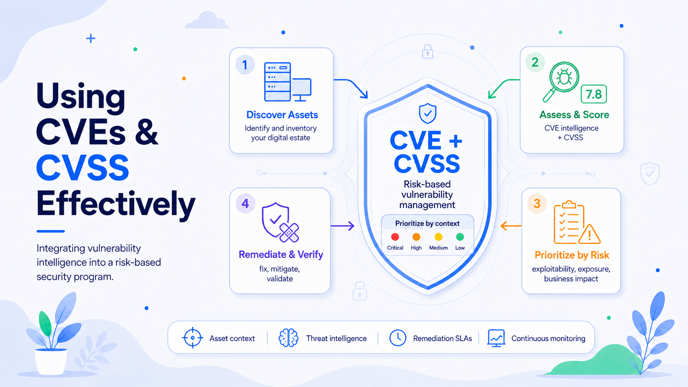

# From CVE Lists to Risk Reduction: Using CVEs and CVSS Scores Effectively

Vulnerability management often starts with Common Vulnerabilities and Exposures, or CVEs. It should not end there. A CVE identifier gives teams a shared reference for a publicly disclosed vulnerability, while the Common Vulnerability Scoring System, or CVSS, describes its technical severity. Together, they create a common language for vendors, scanners, engineers, auditors, and executives.

The guiding principle is simple: **CVE identifies the issue; CVSS describes its characteristics; the organization determines the risk.**

## Understand the Role of CVE and CVSS

The CVE Program identifies, defines, and catalogs publicly disclosed cybersecurity vulnerabilities. A CVE ID lets different tools and teams confirm they are discussing the same issue. CVE is not a complete risk-management system; sources such as the National Vulnerability Database, vendor advisories, and threat-intelligence services add affected-product data, references, classifications, and severity metrics.

CVSS provides a standardized severity score from 0.0 to 10.0. CVSS v4.0 separates Base, Threat, Environmental, and Supplemental metrics. Base metrics describe intrinsic technical characteristics. Threat metrics account for exploitation activity. Environmental metrics adapt the assessment to a specific organization. Supplemental metrics add context without changing the final score.

A CVSS score is not the same as business risk. NIST describes CVSS as a measure of severity, not risk. A critical flaw in an isolated test system may be less urgent than a medium-severity vulnerability on an internet-facing identity server. Two CVEs with the same score may also have very different attack paths and consequences.

## Build an Accurate Asset and Software Inventory

CVE-driven vulnerability management depends on knowing what the organization runs. Teams need an inventory of endpoints, servers, network devices, cloud services, containers, applications, libraries, firmware, and operational technology.

The inventory should record product versions, locations, owners, exposure, business criticality, data sensitivity, and dependencies. Software bills of materials can improve visibility into third-party components. Cloud inventories and configuration-management databases should be reconciled with scanner data rather than treated as separate sources of truth.

Automated product matching can misread backported fixes, custom builds, or vendor-specific package versions. High-impact findings should therefore be checked against vendor advisories and the actual software state. Without reliable inventory data, organizations will patch systems that are not vulnerable while missing assets that are.

## Enrich CVE Records Before Prioritizing Them

A CVE record should be the starting point for analysis. Vulnerability-management platforms should enrich it with vendor advisories, NVD data, full CVSS vectors, exploit availability, threat intelligence, asset exposure, business criticality, existing controls, and internal security findings.

CISA recommends using its Known Exploited Vulnerabilities catalog as an input to prioritization. Inclusion indicates evidence of exploitation in the wild and should usually accelerate action, especially when the affected asset is exposed or business-critical.

Teams should retain the full CVSS vector, not only the headline number. The vector shows whether exploitation is remote, whether privileges or user interaction are required, and which security properties are affected. That detail supports better decisions than a generic “critical” label.

## Replace Score-Only Triage with Risk-Based Prioritization

Treating every CVSS score above a fixed threshold as an emergency is simple to automate but often wastes engineering capacity. Mature programs combine several factors.

**Technical severity:** Use CVSS and its vector as a baseline.

**Exploit activity:** Raise priority for confirmed exploitation, weaponized exploits, ransomware use, or active scanning.

**Exposure:** Internet-facing, remotely reachable, and weakly segmented systems require more urgency.

**Asset criticality:** Consider business function, data sensitivity, availability needs, regulatory importance, and recovery difficulty.

**Control effectiveness:** Segmentation, endpoint protection, authentication, filtering, and monitoring may reduce—but rarely eliminate—risk.

**Potential impact:** Evaluate code execution, account takeover, data loss, disruption, or lateral movement.

These factors can be combined in a decision matrix or risk formula. The objective is not mathematical perfection. It is consistent, explainable prioritization that directs work toward vulnerabilities most likely to cause material harm.

For example, an organization might assign the highest priority to vulnerabilities that are actively exploited, affect externally accessible systems, and could compromise privileged accounts. A technically critical vulnerability on an isolated development workstation may remain important, but it should not automatically displace a lower-scoring flaw that provides attackers with a direct route into production.

## Use CVSS Threat and Environmental Metrics

Many organizations ingest a published Base score and never adjust it. CVSS v4.0 allows consumers to incorporate threat information and local environmental conditions, producing a more relevant assessment.

Environmental scoring can reflect the confidentiality, integrity, and availability requirements of a specific asset. An availability flaw may be especially serious on a production control system, while confidentiality may dominate for a customer-data platform.

Threat metrics help distinguish a theoretical weakness from one being actively exploited. These assessments should be updated as exploit code appears, vendor guidance changes, or threat actors begin targeting the vulnerability.

This process needs governance. Organizations should document who may adjust scores, what evidence is required, how long an adjustment remains valid, and when it must be reviewed. Environmental scoring should improve accuracy, not become a mechanism for lowering inconvenient findings.

## Define Remediation Service Levels by Risk

CVE and CVSS data become operationally useful when they feed clear remediation policies. Instead of one universal deadline, organizations should establish service-level objectives by risk tier.

An actively exploited vulnerability on an exposed critical asset may require mitigation within hours and full remediation within days. A high-severity issue on an internal production system may receive a shorter deadline than the same issue on a non-production asset. Low-risk findings can be handled through routine maintenance.

Each tier should define:

* Response and remediation deadlines
* Escalation paths
* Approved temporary mitigations
* Exception criteria
* Verification requirements

Emergency procedures should support disabling a vulnerable feature, restricting network access, isolating a system, blocking an attack path, or increasing monitoring when immediate patching is impossible.

Remediation deadlines should also account for changing threat conditions. A vulnerability initially classified as routine may need to be escalated when exploitation is confirmed or the affected service becomes externally accessible.

## Integrate Vulnerability Work with Engineering Operations

Vulnerability management fails when findings remain inside a security dashboard. CVE data should flow into ticketing systems, development backlogs, patch-management tools, cloud workflows, and service-management processes.

A remediation ticket should identify the affected asset, CVE, vector, evidence of applicability, risk rationale, fix, owner, deadline, and verification method. Application teams need dependency-level findings tied to repositories and builds. Infrastructure teams need asset-level patch tasks grouped to reduce operational disruption.

For internally developed software, organizations should integrate software composition analysis, container scanning, infrastructure-as-code scanning, and code scanning into continuous integration and delivery pipelines. Release policies can block exploitable high-risk dependencies while allowing documented exceptions for findings that are not reachable or are effectively mitigated.

Automation should reduce administrative effort rather than remove human judgment. Tools can correlate CVEs with assets, generate tickets, assign deadlines, and trigger rescans. Security and engineering teams must still evaluate applicability, exploitability, business impact, and operational constraints.

## Validate Findings and Verify Closure

Scanner output is evidence, not proof. Before escalating a critical issue, teams should confirm that the affected product and version are present, the vulnerable feature is enabled, and vendor guidance applies.

This validation is particularly important when vendors backport security fixes without changing the primary software version. A scanner may identify the version as vulnerable even though the relevant patch has already been applied.

After remediation, re-scan the asset, confirm the version or configuration, test the mitigation, and verify that the vulnerable service is no longer reachable. For application dependencies, rebuild the artifact and confirm that production runs the corrected component. Closing a ticket solely on an owner’s statement creates inaccurate metrics and persistent exposure.

Every risk exception should identify the accountable owner, rationale, compensating controls, expiration date, and review trigger. Permanent exceptions should be avoided because asset exposure, threat activity, and business importance can change.

## Measure Outcomes and Strengthen Governance

Raw counts of open CVEs are poor indicators of security. A large backlog may contain mostly low-impact findings, while a smaller backlog may include several exploitable weaknesses on critical systems.

More useful metrics include:

* Time to identify exposed and exploited vulnerabilities
* Remediation time by risk tier
* Coverage of critical assets
* Percentage of findings with assigned owners
* Failed-remediation and reopened-ticket rates
* Overdue risk exceptions
* Reduction in externally reachable attack paths

Executives need trends, concentrated areas of risk, systemic causes, and business exposure. Technical teams need root-cause data such as unsupported platforms, failed patches, dependency drift, weak ownership, or delays in testing and change approval.

Accountability must also be explicit. Security should own the methodology, enrichment, and assurance process. Technology owners should remediate affected systems. Business owners should accept residual risk. Leadership should resolve priority conflicts and fund structural improvements.

The prioritization model should be reviewed against incidents, penetration tests, near misses, and threat trends. If exploited vulnerabilities repeatedly remain open because systems cannot tolerate maintenance, the problem may be fragile architecture, unsupported technology, inadequate redundancy, or unclear ownership.

## Conclusion

CVE and CVSS provide essential standardization, but not judgment. Strong vulnerability-management programs combine them with threat activity, asset context, exposure, security controls, and business impact. They then convert that analysis into enforceable deadlines, integrated engineering work, verified remediation, and meaningful governance.

The question is not simply, “Which vulnerability has the highest score?” It is: **“Which vulnerability creates the most credible path to material harm in our environment, and what action reduces that risk fastest?”**
