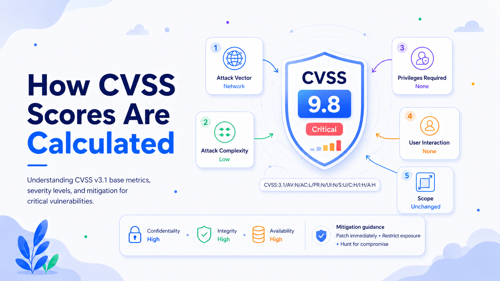

# Calculating CVSS v3.1 for an Unauthenticated Web-Server RCE

The Common Vulnerability Scoring System (CVSS) standardizes descriptions of vulnerability severity. In CVSS v3.1, the Base Score represents intrinsic characteristics and ranges from 0.0 to 10.0. Temporal and Environmental metrics can refine it using exploit, remediation, control, and asset context.

This calculation addresses the following scenario:

> A remote code execution vulnerability affects widely used web server software. An attacker can execute arbitrary code remotely without authentication.

An exposed server may therefore be compromised without credentials or victim participation.

## Resolving the Example-Metric Conflict

The supplied example lists “Privileges Required: Required” and “User Interaction: Required.” Those values conflict with the scenario. CVSS v3.1 defines Privileges Required as **None, Low, or High**, not simply “Required.” Because authentication is unnecessary, the correct value is **None**. The scenario also does not require a user to click, open, or approve anything, so User Interaction is **None**. FIRST defines Privileges Required: None as an attack performed while unauthorized, and User Interaction: None as exploitation carried out solely at the attacker’s initiative.

The score should therefore follow the vulnerability description, not the contradictory example.

## Selecting the Base Metrics

| Metric              |           Value | Weight | Rationale                                            |
| ------------------- | --------------: | -----: | ---------------------------------------------------- |
| Attack Vector       |  Network (AV:N) |   0.85 | The attacker reaches the server remotely.            |
| Attack Complexity   |      Low (AC:L) |   0.77 | No unusual precondition is stated.                   |
| Privileges Required |     None (PR:N) |   0.85 | No account or session is needed.                     |
| User Interaction    |     None (UI:N) |   0.85 | No separate victim action is required.               |
| Scope               | Unchanged (S:U) |      — | Code executes under the server’s security authority. |
| Confidentiality     |      High (C:H) |   0.56 | Sensitive data and secrets may be exposed.           |
| Integrity           |      High (I:H) |   0.56 | Code, data, configuration, or logs may be altered.   |
| Availability        |      High (A:H) |   0.56 | The service may be stopped or corrupted.             |

FIRST describes Network as remotely exploitable across one or more network hops and assigns the listed weights to these metrics.

### Scope and Impact Assumptions

Scope asks whether exploitation crosses a security-authority boundary. Here, the vulnerable web server is also the component in which arbitrary code executes. Unless additional facts show a breakout into a separately governed host, hypervisor, tenant, or security domain, **Scope is Unchanged**. Extensive control does not by itself make Scope Changed.

A Base Score also requires Confidentiality, Integrity, and Availability values. Unrestricted arbitrary code execution supports **High** for all three because an attacker may read information, modify protected resources, and disrupt the service. FIRST defines High as a total or serious loss of the relevant security property.

## CVSS Vector

The selected metrics produce:

`CVSS:3.1/AV:N/AC:L/PR:N/UI:N/S:U/C:H/I:H/A:H`

The vector should accompany the score because it exposes the assumptions and makes the calculation reproducible.

## Calculating the Base Score

### 1. Impact Sub-Score

CVSS v3.1 begins with:

`ISS = 1 − [(1 − C) × (1 − I) × (1 − A)]`

With C, I, and A all High, each value is 0.56:

`ISS = 1 − [(1 − 0.56) × (1 − 0.56) × (1 − 0.56)]`

`ISS = 1 − (0.44 × 0.44 × 0.44)`

`ISS = 1 − 0.085184 = 0.914816`

Because Scope is Unchanged:

`Impact = 6.42 × ISS`

`Impact = 6.42 × 0.914816 = 5.87311872`

### 2. Exploitability

The formula is:

`Exploitability = 8.22 × AV × AC × PR × UI`

Substituting the selected values:

`Exploitability = 8.22 × 0.85 × 0.77 × 0.85 × 0.85`

`Exploitability = 3.887042775`

### 3. Final Base Score

For Scope Unchanged:

`Base Score = Roundup(Minimum[Impact + Exploitability, 10])`

Therefore:

`Base Score = Roundup(Minimum[5.87311872 + 3.887042775, 10])`

`Base Score = Roundup(9.760161495)`

CVSS rounds upward to one decimal place rather than using ordinary nearest-value rounding. The result is:

## **CVSS v3.1 Base Score: 9.8 — Critical**

The CVSS v3.1 qualitative scale classifies 9.0–10.0 as Critical. The vector can be entered into a compatible CVSS v3.1 calculator to verify the result.

## Interpreting the 9.8 Score

A 9.8 score indicates exceptional technical severity. The vulnerability is network-reachable, has no stated special exploitation conditions, requires no privileges, requires no user interaction, and may cause extensive loss of confidentiality, integrity, and availability.

For an internet-facing server, the attacker population is broad. Exploitation could expose secrets, credentials, certificates, or customer data; alter applications; install web shells; interrupt services; or enable lateral movement.

Widespread use does not change the Base Score because prevalence is not a Base metric. It does increase operational concern because affected copies may exist across production, testing, images, appliances, and cloud templates.

CVSS Base Score is not a complete risk calculation. It omits factors such as actual exposure, active exploitation, asset count, business criticality, and compensating controls. FIRST recommends combining Base severity with Temporal and Environmental metrics and organizational context.

An isolated test server and an external payment portal can share a 9.8 Base Score while presenting different business risk. The score establishes urgency; environmental context determines exact response order.

## Implications for the Security Posture

A confirmed unauthenticated RCE should trigger the highest vulnerability-response tier.

**Exposure management:** Find every affected version, including unmanaged hosts, containers, appliances, and embedded software.

**Credential security:** A compromised server may expose passwords, tokens, API keys, or private keys. Patching does not revoke stolen secrets.

**Lateral movement:** Public servers often connect to internal services. Weak segmentation can turn one compromise into a larger incident.

**Incident response:** If exploitation may have occurred before remediation, teams must look for web shells, persistence, modified scripts, malicious modules, unexpected accounts, and suspicious outbound traffic.

**Business continuity:** Emergency patching may cause controlled downtime, but delayed action can produce a larger unplanned outage. Redundancy, rollback testing, and emergency change procedures matter.

## Recommended Mitigation Strategies

### 1. Initiate Emergency Remediation

Place the issue in the critical-response workflow. Prioritize internet-facing systems, high-value applications, management interfaces, and servers handling sensitive data. Do not defer it to a routine monthly cycle.

### 2. Identify All Affected Assets

Use scanners, cloud inventories, package data, container registries, software composition analysis, and network discovery. Find direct and embedded copies, then verify the running version.

### 3. Patch, Upgrade, or Remove the Component

Install the vendor’s fixed release. Where immediate patching is impossible, disable the vulnerable feature, remove the module, stop the service, or isolate the system. Give temporary workarounds an owner and expiration date.

### 4. Reduce Network Exposure

Restrict access with firewalls, security groups, reverse proxies, allowlists, VPNs, or zero-trust controls. Remove unnecessary public exposure and block vulnerable endpoints. WAF or intrusion-prevention rules may help, but they are compensating controls rather than substitutes for patching.

### 5. Hunt for Compromise

Review server, proxy, endpoint, authentication, DNS, and network telemetry. Investigate unusual child processes, new web-directory files, changed configuration, unexpected outbound traffic, accounts, and persistence. Preserve evidence before rebuilding.

### 6. Rotate Exposed Secrets

Assume credentials accessible to the server process may be compromised. Rotate service passwords, API keys, database credentials, tokens, certificates, and private keys as appropriate. Revoke active sessions and review machine-identity permissions.

### 7. Strengthen Containment

Run the service with least privilege, restrict outbound access, segment public workloads from management networks, and apply sandboxing or mandatory access controls. Containers help only when they are not privileged and do not expose sensitive host resources.

### 8. Verify Remediation

Rescan systems, confirm the fixed version is active, and restart processes where required. Update base images, deployment templates, autoscaling configurations, backups, and recovery images so vulnerable builds cannot return.

## Conclusion

The correct vector for the described unauthenticated web-server RCE is:

`CVSS:3.1/AV:N/AC:L/PR:N/UI:N/S:U/C:H/I:H/A:H`

The calculated CVSS v3.1 Base Score is **9.8, Critical**. The result is driven by remote network reachability, low complexity, no authentication, no user interaction, and High impact across confidentiality, integrity, and availability.

For an organization, this score warrants emergency remediation, immediate exposure reduction, compromise assessment, credential rotation, and verification across deployment and recovery systems. CVSS measures technical severity; asset importance, exposure, and evidence of exploitation determine the final response order.
