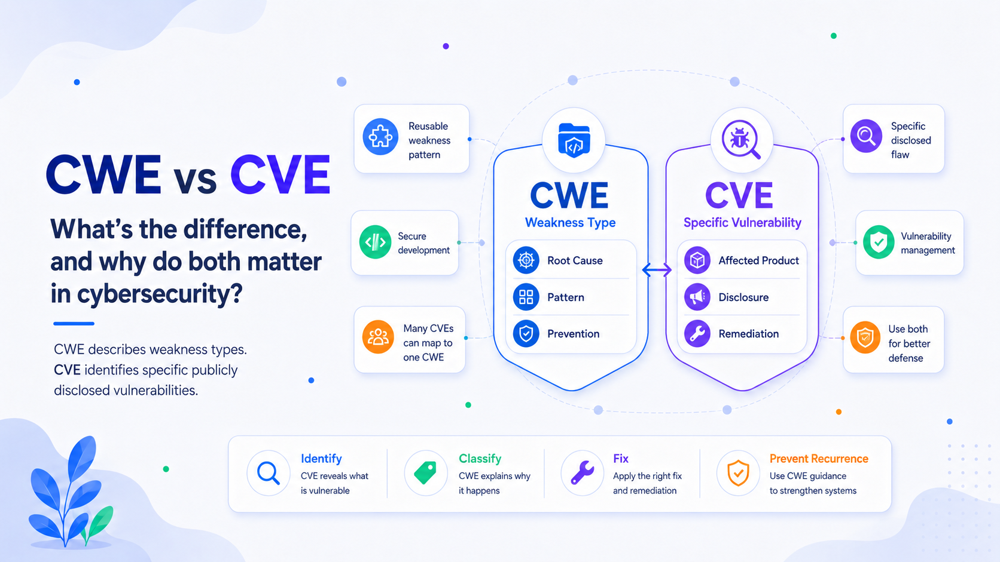

# CWE vs. CVE: What Is the Difference, and Why Do Both Matter?

Cybersecurity teams frequently encounter two similar acronyms: **CWE** and **CVE**. They are related, but they describe different layers of a security problem.

A **CWE** identifies a general type of weakness, such as broken authorization or an out-of-bounds write. A **CVE** identifies a specific, publicly disclosed vulnerability in a particular product or codebase.

Put simply, **CWE explains the kind of mistake that occurred; CVE identifies a concrete instance of that mistake**. CVE supports detection, tracking, and remediation. CWE supports root-cause analysis, secure development, and prevention.

## What Is CWE?

**CWE**, or **Common Weakness Enumeration**, is a community-developed catalog of software and hardware weakness types maintained by MITRE. It provides a common language for conditions in design, architecture, code, or implementation that can contribute to security vulnerabilities.

Each entry uses the format `CWE-number`. Examples include:

* **CWE-79:** A weakness associated with cross-site scripting.
* **CWE-89:** A weakness associated with SQL injection.
* **CWE-287:** Improper authentication.
* **CWE-312:** Cleartext storage of sensitive information.

A CWE normally does not refer to one vendor, application, or release. It describes a reusable weakness pattern that can appear in many systems. Many unrelated products may contain SQL injection vulnerabilities, but their underlying weakness can still be classified as CWE-89.

CWE is hierarchical, ranging from broad classes to specific variants. Organizations use it in secure-coding standards, code reviews, threat modeling, security tools, training, and metrics to understand why defects recur.

## What Is CVE?

**CVE**, or **Common Vulnerabilities and Exposures**, is an international program for identifying, defining, cataloging, and sharing information about publicly disclosed cybersecurity vulnerabilities. Each qualifying vulnerability receives a unique identifier, such as `CVE-2026-20930`, so vendors, researchers, defenders, scanners, and customers can refer to the same issue consistently.

A CVE ID follows this format:

`CVE-YEAR-SEQUENCE`

A CVE Record usually includes a description, references, and affected-product information. Records are created through CVE Numbering Authorities, or CNAs, including vendors, open-source projects, and coordination centers. A CVE may identify, for example, an authentication bypass in a defined application version.

CVE should not be confused with the **National Vulnerability Database**, or NVD. The CVE Program publishes identifiers and baseline records. NVD, operated by NIST, imports CVEs and may enrich them with CVSS severity metrics, CWE classifications, and CPE applicability statements.

## The Core Difference

The distinction can be summarized in one sentence:

> **CWE classifies the weakness; CVE identifies the vulnerability.**

Suppose an application inserts untrusted input directly into a database query. The underlying weakness may be **CWE-89**, SQL injection. If researchers discover that flaw in version 4.2 of a named product and it is publicly disclosed, the specific vulnerability may receive a CVE ID.

CWE answers:

* What kind of security mistake occurred?
* What coding, design, or architectural condition caused it?
* How can similar weaknesses be prevented?
* Which patterns recur across products?

CVE answers:

* Which exact vulnerability is being discussed?
* Which product and versions are affected?
* What patch, advisory, or mitigation applies?
* Does the organization operate an affected system?

Many CVEs can map to the same CWE because one weakness type can occur in many products. A CVE may also link to multiple CWEs when several mechanisms contribute to the flaw. Mappings are not always precise, especially when public details are limited. NVD uses CWE to classify CVEs at both broad and detailed levels.

## CWE vs. CVE at a Glance

| Dimension        | CWE                                  | CVE                                           |
| ---------------- | ------------------------------------ | --------------------------------------------- |
| Purpose          | Classify weakness types              | Identify disclosed vulnerabilities            |
| Scope            | General pattern or root cause        | Particular flaw in a product                  |
| Example          | `CWE-89`                             | `CVE-2026-20930`                              |
| Product-specific | Usually no                           | Yes                                           |
| Main users       | Developers, architects, AppSec teams | SOC teams, vulnerability managers, responders |
| Main value       | Prevention and root-cause analysis   | Detection, coordination, and remediation      |
| Severity score   | No                                   | Not inherently                                |

A CWE number is not a risk score, and a CVE ID does not mean an issue is critical. CVE provides identity; CWE provides classification. Systems such as CVSS estimate technical severity, while organizational risk also depends on exploit activity, exposure, asset importance, controls, and business impact.

## Why CVE Is Important

CVE creates a shared reference point for vulnerability management. Without a standard identifier, the same flaw could appear under different vendor names, scanner labels, or advisory titles.

CVE enables scanners, advisories, endpoint tools, and software-composition-analysis platforms to reference the same issue. It also connects vendor fixes, internal tickets, exceptions, exploit intelligence, audit evidence, and validation results. Structured CVE data supports automated security workflows and precise coordination among vendors, researchers, customers, and responders.

CVE is essential, but it is not a complete risk decision. A new CVE may contain limited information or have no known exploitation. Conversely, a moderate-severity issue may require immediate action when it affects an internet-facing, business-critical system.

## Why CWE Is Important

CVE helps organizations fix known vulnerabilities. CWE helps them reduce the chance of producing similar vulnerabilities again.

CWE enables root-cause analysis by showing when unrelated CVEs stem from one recurring failure, such as missing authorization checks. Teams can reference CWE categories in design rules, coding standards, security testing, and developer training. They can also measure which weakness types occur most often and whether preventive controls are working. Patching a CVE removes one known exposure; addressing the underlying CWE can prevent a broader class of defects.

## How CWE and CVE Work Together

Effective security programs use CWE and CVE as complementary layers.

Assume a scanner detects several CVEs across an organization’s web applications. The vulnerability-management team uses the CVE IDs to identify affected assets, assess exploit intelligence, assign owners, and verify patches.

The application-security team then groups those vulnerabilities by CWE. If many map to injection or improper authorization, the pattern becomes an engineering signal. The organization can update shared libraries, strengthen design standards, tune analysis rules, improve tests, and train developers.

A mature workflow is:

1. **Identify** the specific vulnerability using CVE.
2. **Classify** the underlying weakness using CWE.
3. **Prioritize** remediation using severity, exposure, threat activity, and business impact.
4. **Fix** the affected product or deployment.
5. **Prevent recurrence** through design, coding, testing, and governance changes.
6. **Measure results** by tracking whether the same CWE categories return.

NVD demonstrates this relationship by enriching CVEs with CWE mappings, CVSS data, and platform-applicability information. These datasets serve different purposes but are more useful together.

## Important Clarifications

A CWE is not automatically a vulnerability. It describes a weakness type, which may exist without being publicly disclosed, assigned a CVE, or proven exploitable.

Not every CVE has a precise CWE mapping. Some disclosures lack enough technical detail to determine the root cause, so a CVE may receive a broad category, multiple mappings, or an insufficient-information classification.

A CVE ID also does not indicate severity. It establishes which vulnerability is being referenced. Technical severity and business risk require additional data.

Finally, CVE and NVD are not the same service. CVE supplies identifiers and baseline records; NVD imports CVEs and adds enrichment used by many security tools.

## Conclusion

CWE and CVE are not competing standards. They solve different parts of the cybersecurity problem.

**CVE identifies a specific, publicly disclosed vulnerability. CWE classifies the underlying type of weakness that can create vulnerabilities.** CVE supports coordination, detection, patching, and operational tracking. CWE supports root-cause analysis, secure design, education, tool interoperability, and prevention.

Used together, they connect immediate vulnerability response with long-term security improvement. CVE tells a team what must be addressed. CWE explains why it happened and helps prevent the same class of problem from returning.
