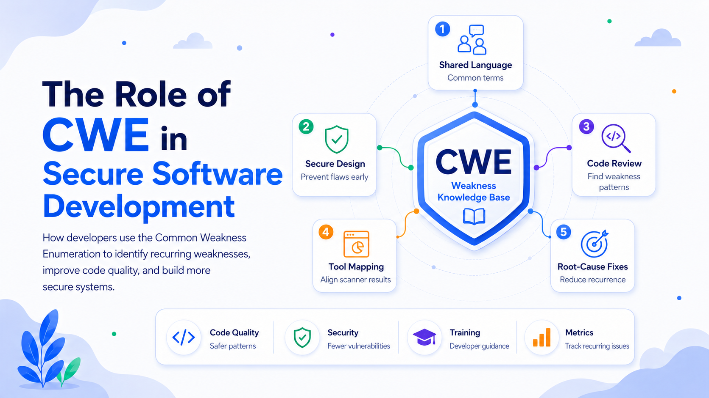

# The Role of CWE in Secure Software Development

Secure software development requires more than patching vulnerabilities after release. Teams must understand the recurring mistakes that create vulnerabilities, prevent them during design and implementation, and use consistent terminology when reviewing software. The Common Weakness Enumeration, or CWE, provides that foundation.

CWE is a community-developed catalog and classification system for software and hardware weaknesses. A weakness is a condition in architecture, design, code, configuration, or implementation that can contribute to an exploitable vulnerability. Instead of describing one affected product, CWE identifies the underlying type of mistake, such as SQL injection, path traversal, out-of-bounds memory access, or hard-coded credentials.

A CVE generally identifies a vulnerability in a particular product or version; a CWE identifier describes the weakness class that caused or enabled it. CWE therefore helps teams move beyond fixing one defect. They can search for related flaws, strengthen engineering controls, and reduce recurrence.

## A Common Language for Software Security

Security findings are often described differently by developers, testers, and tools. A developer may report “unsafe query construction,” a penetration tester may call it “SQL injection,” and a static analyzer may say that untrusted data reaches a database command. Mapping the issue to CWE-89 gives all parties a shared reference.

This language improves communication among developers, security engineers, architects, auditors, tool vendors, and managers. Results from code review, static analysis, penetration testing, bug bounty programs, and incidents can be grouped by weakness type, making patterns easier to identify.

CWE is hierarchical, ranging from broad classes to technology-specific variants. Its Software Development view organizes weaknesses around developer concepts and can be filtered by the lifecycle phase in which a weakness is introduced.

## Using CWE Across the Development Lifecycle

CWE provides the most value when integrated throughout development rather than applied only after testing.

### Requirements and Planning

Teams can translate relevant CWE categories into security requirements and acceptance criteria. A system handling sensitive data may prioritize authorization, credential storage, information exposure, input validation, logging, and resource limits.

The objective is not to attach hundreds of identifiers to every project. Teams should create a risk-based baseline reflecting the architecture, technology stack, data sensitivity, threat model, and defect history.

The CWE Top 25 is useful for initial prioritization because it highlights weaknesses that are common and consequential. It is a starting point, not a complete checklist; product-specific risks may fall outside a general ranking.

### Architecture and Design

Many weaknesses originate before code is written. CWE supports threat modeling and architecture reviews by drawing attention to unsafe trust boundaries, missing authorization controls, excessive privilege, weak isolation, and dangerous assumptions about external components.

For example, browser-side access checks may create CWE-602, Client-Side Enforcement of Server-Side Security, while an overprivileged service may introduce CWE-250, Execution with Unnecessary Privileges.

### Implementation

For developers, CWE turns abstract guidance into recognizable defect patterns. Entries commonly include descriptions, consequences, examples, mitigations, applicable technologies, and detection approaches.

High-priority CWEs can become concrete coding rules:

* Use parameterized database interfaces to prevent CWE-89, SQL Injection.
* Apply context-appropriate output encoding to prevent CWE-79, Cross-Site Scripting.
* Normalize and constrain file paths to address CWE-22, Path Traversal.
* Keep secrets out of source code to prevent CWE-798, Use of Hard-coded Credentials.
* Enforce bounds or use memory-safe abstractions to reduce CWE-787, Out-of-bounds Write.
* Avoid unsafe object reconstruction to address CWE-502, Deserialization of Untrusted Data.

The identifier supplies security context, but internal standards should also name approved libraries, secure examples, tests, and prohibited patterns.

### Code Review and Testing

CWE gives reviewers a systematic basis for security checks. Review lists can be tailored to the component, such as injection and authorization for database code or path handling and file validation for upload services.

Many security tools map findings to CWE identifiers. This normalizes reports from different scanners and lets developers research issues independently of vendor terminology. CWE compatibility information may show which weaknesses a tool claims to detect, although claimed coverage is not proof that an application is secure.

No single method finds every weakness. Static analysis identifies suspicious data flows, dynamic testing observes runtime behavior, composition analysis finds dependency risks, and manual review remains important for authorization and business logic. CWE provides a shared structure for combining these results.

### Remediation and Root-Cause Analysis

A basic remediation process closes tickets. A mature process asks why the weakness entered the product and how to prevent recurrence.

After mapping a finding to the most specific supported CWE, teams should determine where it was introduced, whether standards addressed it, whether a framework or test could have caught it, and whether a shared component could eliminate the defect class. MITRE’s guidance emphasizes identifying the underlying weakness rather than stopping at a symptom or broad category.

Corrective action should be systemic: update a framework, prohibit a dangerous API, strengthen a requirement, add a reusable control, improve tests, or introduce an automated guardrail. The aim is not only to fix the bug, but to make that type of bug harder to create.

## Practical Ways Developers Can Leverage CWE

### Build a Relevant Baseline

Select a manageable set of high-risk CWEs using the threat model, technology stack, incident history, and scanner data. Combine general priorities with product-specific risks, and review the baseline periodically because CWE is a living catalog.

Different products require different baselines. A public web application may emphasize injection, cross-site scripting, authentication, and access control. Embedded software may place greater weight on memory safety, integer handling, concurrency, and privilege boundaries. Cloud-native systems may require additional attention to identity configuration, exposed services, secret management, and dependency security.

### Add CWE to Everyday Workflows

Include identifiers in security requirements, threat-model findings, pull-request comments, scanner results, defect tickets, and incident reports. The identifier should supplement—not replace—a precise explanation.

For example:

> CWE-89: The user-controlled `sort` value is concatenated into a SQL statement. Replace dynamic construction with an allowlisted column mapping and a parameterized query.

This is more actionable than a ticket containing only “possible injection.” It identifies the weakness, shows where it occurs, and specifies the expected remediation.

Teams should also preserve CWE mappings when findings move between tools. A scanner result may become a development ticket, a pull request, a test case, and eventually an incident record. Retaining the identifier allows the organization to analyze the full lifecycle of that weakness.

### Convert CWE Knowledge into Guardrails

For recurring weaknesses, prefer controls that reduce developer discretion:

* Safe framework defaults instead of repeated manual validation.
* Parameterized APIs instead of string-built queries.
* Centralized authorization middleware instead of scattered checks.
* Managed secret storage instead of credentials in configuration files.
* Memory-safe languages or hardened libraries for high-risk components.
* Continuous integration rules that reject dangerous functions and patterns.

Training matters, but architectural and automated controls are more reliable under delivery pressure. A developer can forget a rule. A safe API, restrictive framework configuration, or build-time policy can enforce that rule consistently.

This approach also improves code quality. Centralized controls reduce duplicated logic, approved libraries improve consistency, and automated checks detect defects earlier. Security becomes part of maintainability rather than a separate activity performed before release.

### Improve Security Training

CWE enables role-specific training. Backend developers can focus on injection and authorization, frontend teams on output encoding and trust boundaries, and systems programmers on memory safety and privilege separation.

Training is strongest when it uses examples from the organization’s own defects. A useful session should show the vulnerable implementation, explain the relevant CWE, demonstrate a secure alternative, and provide a test that verifies the correction.

CWE can also help teams select training based on observed needs. If defect data shows repeated authorization weaknesses, additional generic phishing training will not solve the engineering problem. Developers need practical instruction on authorization design, object ownership, policy enforcement, and negative test cases.

### Measure Recurring Weaknesses

CWE-based metrics can show which weakness classes recur, where they enter the lifecycle, and whether corrective actions worked. Useful measures include frequency, recurrence rate, remediation time, and defect density before and after a new control.

For example, an organization may discover that SQL injection findings have declined after adopting a safer data-access layer, while access-control weaknesses remain frequent. That evidence supports targeted investment in centralized authorization and improved security testing.

These metrics should improve processes, not rank developers. Security defects are often symptoms of unclear requirements, unsafe frameworks, missing tests, or inadequate review practices. Blaming individuals discourages reporting and hides systemic causes.

## Limitations and Common Misuses

CWE is a taxonomy and knowledge base, not a complete secure coding standard. It does not determine exploitability, business impact, or remediation priority. Two findings mapped to the same CWE may have very different risk depending on exposure, privileges, reachable attack paths, and data sensitivity.

Teams should avoid mappings that are too broad or falsely precise. A broad parent category may be easy to assign but provide little value for root-cause analysis. An extremely specific identifier may create false confidence when the available evidence does not support it. The best mapping is the most specific weakness supported by the facts.

CWE should also not become a compliance checklist. A team may demonstrate coverage of numerous CWE entries while still missing architectural flaws, unsafe business processes, or complex authorization problems. Secure development requires threat modeling, secure design, implementation controls, testing, monitoring, and incident response in addition to weakness classification.

Tool mappings require validation as well. A scanner may associate a rule with a CWE when the result is a false positive or the true root cause differs. Automated mappings accelerate analysis, but human review remains necessary.

## Conclusion

CWE plays a central role in secure software development by providing a structured language for the weaknesses that create vulnerabilities. It connects requirements, architecture, coding, testing, remediation, training, and measurement.

Developers gain the most value by selecting relevant weakness classes, integrating them into normal workflows, translating them into secure coding standards and automated guardrails, and analyzing defects at their root cause. The result is fewer recurring defects, clearer security decisions, and code that is easier to review and maintain.
