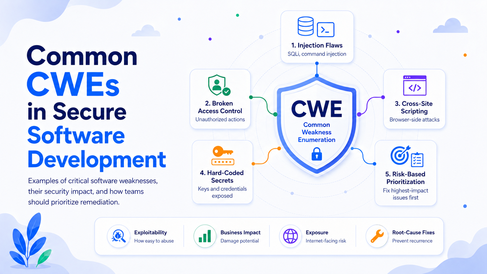

# Common CWEs: Security Impact and How to Prioritize Remediation

Software vulnerabilities rarely appear as isolated coding mistakes. Most belong to recurring classes of weaknesses that affect applications across programming languages, architectures, and industries. The Common Weakness Enumeration, or CWE, provides a standardized vocabulary for describing these underlying security defects.

Unlike a specific vulnerability record, such as a CVE, a CWE describes a general type of weakness. For example, a CVE may document a vulnerability in one version of a web application, while its root cause may be categorized as CWE-89: Improper Neutralization of Special Elements Used in an SQL Command, commonly known as SQL injection.

Understanding common CWEs helps development teams identify systemic problems, improve secure coding standards, and prioritize remediation based on actual risk rather than treating every finding as equally urgent.

## 1. CWE-79: Cross-Site Scripting

Cross-site scripting, or XSS, occurs when an application includes untrusted data in a web page without correctly validating, encoding, or sanitizing it. An attacker can inject JavaScript or other active content that executes in another user’s browser.

XSS commonly appears in search fields, comments, profile data, support tickets, and URL parameters. It may be stored in the application database, reflected immediately in a response, or introduced through unsafe client-side JavaScript.

The potential impact includes:

* Theft of session tokens or sensitive page content
* Account takeover
* Unauthorized actions performed in the victim’s session
* Redirection to malicious websites
* Modification of page content
* Credential-harvesting attacks
* Compromise of administrative users

The severity depends heavily on context. XSS in a public marketing page may be disruptive, while stored XSS in an administrative dashboard may provide a practical path to full application compromise.

Key defenses include context-sensitive output encoding, safe templating frameworks, strict handling of HTML input, secure cookie attributes, and Content Security Policy. Input validation is useful, but it should not replace correct output encoding.

## 2. CWE-89: SQL Injection

SQL injection occurs when untrusted input is incorporated into a database query in a way that allows the input to alter the query’s intended structure.

For example, an application might construct a query by concatenating a username directly into an SQL statement. A maliciously crafted value could change the query logic, bypass authentication, retrieve unauthorized records, modify data, or execute database administration operations.

Potential consequences include:

* Exposure of customer or employee records
* Authentication bypass
* Modification or deletion of data
* Disclosure of password hashes or cryptographic material
* Escalation of database privileges
* Execution of operating-system commands in some environments
* Complete compromise of the application’s data layer

SQL injection should usually be treated as a critical weakness because it is often remotely exploitable and may affect the confidentiality, integrity, and availability of the entire system.

The primary defense is parameterized querying through prepared statements or trusted object-relational mapping interfaces. Additional protections include least-privilege database accounts, query allowlists for dynamic identifiers, centralized data-access layers, and monitoring for abnormal query activity.

## 3. CWE-78: Operating System Command Injection

Operating system command injection occurs when an application uses untrusted input to construct a shell command. An attacker may insert shell metacharacters, additional commands, or manipulated arguments that cause the operating system to perform unintended actions.

This weakness often appears in functionality involving file conversion, network diagnostics, backup operations, media processing, system administration, or calls to external utilities.

Its impact can be severe:

* Arbitrary command execution
* Theft or destruction of files
* Installation of malware
* Creation of unauthorized accounts
* Movement into internal systems
* Service disruption
* Full server compromise

Command injection differs from ordinary input validation problems because successful exploitation may give the attacker direct control over the host environment.

The safest approach is to avoid invoking a shell. Applications should use language-native libraries or APIs instead of operating-system commands whenever possible. When external processes are required, arguments should be passed as separate values, strict allowlists should be enforced, and the process should run with minimal privileges.

## 4. CWE-22: Path Traversal

Path traversal occurs when an application accepts user-controlled file or directory names without adequately restricting the resulting path. Attackers may use sequences such as `../` or encoded alternatives to escape an intended directory.

Typical targets include download endpoints, document viewers, archive extraction features, template loaders, image services, and backup interfaces.

Potential impact includes:

* Reading configuration files
* Accessing credentials or private keys
* Retrieving source code
* Overwriting application files
* Placing executable content in sensitive directories
* Deleting files
* Bypassing authorization controls

Path traversal may also combine with other weaknesses. Reading an application configuration file could reveal database credentials, while writing to a web-accessible directory might enable remote code execution.

Defenses include resolving paths to a canonical form, verifying that the resolved path remains within an approved base directory, using indirect object identifiers, rejecting unexpected path separators, and separating user-controlled files from application and system directories.

## 5. CWE-287 and CWE-306: Authentication Failures

CWE-287 covers improper authentication, while CWE-306 describes missing authentication for critical functionality. These weaknesses occur when an application does not reliably verify identity or fails to require authentication for sensitive operations.

Examples include:

* APIs that trust a user identifier supplied by the client
* Administrative endpoints without authentication
* Password-reset flows with predictable tokens
* Authentication checks performed only in the user interface
* Systems that accept unsigned or improperly validated tokens
* Alternate application paths that bypass normal login controls

The impact may include unauthorized access, account takeover, administrative compromise, data exposure, or execution of privileged operations.

Authentication controls should be centralized and consistently enforced on the server. Tokens must be cryptographically verified, session lifetimes should be appropriate to the application’s risk, and sensitive operations may require reauthentication or multi-factor authentication. All alternate interfaces, including mobile APIs, internal endpoints, and legacy routes, must apply the same controls.

## 6. CWE-862 and CWE-863: Authorization Failures

Authentication determines who a user is. Authorization determines what that user is permitted to do. CWE-862 represents missing authorization, while CWE-863 covers incorrect authorization.

A common example is an endpoint that retrieves an invoice using a numeric identifier. Even when the user is properly authenticated, the application may fail to verify that the requested invoice belongs to that user.

Authorization weaknesses can lead to:

* Exposure of other users’ records
* Unauthorized modification or deletion of data
* Privilege escalation
* Access to administrative functionality
* Cross-tenant data leakage
* Abuse of business processes

These weaknesses are particularly dangerous in multi-tenant systems, financial platforms, healthcare applications, and business-to-business software.

Authorization decisions should be made on the server for every protected operation. The system should deny access by default, evaluate ownership and tenant boundaries, and avoid relying on hidden interface elements as a security mechanism. Centralized policy enforcement and automated authorization tests are especially valuable.

## 7. CWE-798 and CWE-259: Hard-Coded Credentials

Hard-coded credentials occur when passwords, API keys, cryptographic secrets, or access tokens are embedded directly in source code, scripts, configuration templates, container images, or compiled binaries.

Once committed to a repository, a secret may remain recoverable from version history even after the visible line is removed. It may also be copied into build logs, artifacts, developer machines, or third-party systems.

Potential impact includes:

* Unauthorized access to cloud services
* Database compromise
* Abuse of external APIs
* Exposure of production systems
* Supply-chain compromise
* Financial loss from unauthorized resource consumption

Secrets should be stored in a dedicated secrets-management system and injected at runtime. Access must follow least-privilege principles, and credentials should be rotated regularly. When a secret is exposed, removing it from the current source file is insufficient; the team should revoke or rotate it immediately and investigate where it may have propagated.

## 8. CWE-502: Deserialization of Untrusted Data

Deserialization converts stored or transmitted data back into program objects. Insecure deserialization occurs when an application processes attacker-controlled serialized data using a mechanism that can instantiate unexpected classes, invoke dangerous methods, or manipulate internal application state.

Depending on the language and framework, exploitation may lead to:

* Remote code execution
* Authentication or authorization bypass
* Modification of business logic
* Denial of service
* Injection of malicious objects
* Data tampering

Insecure deserialization can be difficult to detect because the vulnerable code may appear to perform a routine data-conversion operation.

Applications should avoid native object deserialization for untrusted data. Safer formats such as JSON should be parsed into explicit data structures with strict schemas. Allowed types and fields should be constrained, integrity protections should be applied where appropriate, and unsafe deserialization libraries should be disabled or removed.

## 9. CWE-787 and CWE-125: Memory-Safety Weaknesses

CWE-787 describes out-of-bounds writes, while CWE-125 covers out-of-bounds reads. These weaknesses are most common in languages that permit direct memory access, such as C and C++.

An out-of-bounds write may overwrite adjacent memory, corrupt control data, or alter program behavior. An out-of-bounds read may expose sensitive information or cause a crash.

Potential consequences include:

* Remote code execution
* Information disclosure
* Application crashes
* Corruption of files or in-memory data
* Security-control bypass
* Persistent compromise of embedded devices or operating-system components

Memory corruption findings should receive high priority when they affect network-facing parsers, privileged processes, security appliances, operating-system components, or widely distributed client software.

Defenses include adopting memory-safe languages for new components, using bounds-checked abstractions, enabling compiler and operating-system protections, applying static and dynamic analysis, fuzz testing parsers, and minimizing unsafe code.

## 10. CWE-352: Cross-Site Request Forgery

Cross-site request forgery, or CSRF, causes an authenticated user’s browser to submit an unwanted request to an application. The attack succeeds when the application relies on automatically included credentials, such as cookies, but does not verify that the request was intentionally initiated by the user.

A successful CSRF attack may:

* Change account details
* Modify an email address or password
* Initiate a transaction
* Create an administrative user
* Alter security settings
* Delete data

Applications should use anti-CSRF tokens for state-changing requests, apply appropriate `SameSite` cookie attributes, validate request origin information, and avoid using `GET` requests for operations that modify state. Highly sensitive actions may require reauthentication or an additional confirmation step.

## 11. CWE-918: Server-Side Request Forgery

Server-side request forgery, or SSRF, occurs when an attacker can influence a server to make network requests to an unintended destination.

The attacker may target internal services that are inaccessible from the public internet, cloud metadata endpoints, management interfaces, or other trusted systems. Because the request originates from the vulnerable server, it may bypass network restrictions or appear to come from a trusted source.

The impact can include:

* Theft of cloud credentials
* Access to internal APIs
* Internal network reconnaissance
* Bypass of firewalls or access controls
* Data exfiltration
* Interaction with administrative services
* Remote code execution when combined with another weakness

Defenses should include destination allowlists, network egress controls, blocking private and link-local address ranges where unnecessary, validating redirects, normalizing domain names and IP addresses, and separating request-processing services from sensitive network zones.

## 12. CWE-400: Uncontrolled Resource Consumption

Uncontrolled resource consumption occurs when an application allows users to consume excessive CPU time, memory, storage, threads, database connections, or network capacity.

Examples include unrestricted file uploads, computationally expensive search queries, decompression bombs, deeply nested data, repeated password-hashing operations, and APIs without request limits.

The result may be:

* Denial of service
* Increased cloud costs
* Degraded performance for legitimate users
* Exhaustion of shared infrastructure
* Failure of dependent services

Controls should include request-size limits, timeouts, concurrency limits, quotas, rate limiting, bounded data structures, workload isolation, and careful handling of compressed or recursively structured input.

# How to Prioritize CWE Remediation

A long list of findings should not be treated as a simple queue ordered only by scanner severity. Effective prioritization combines technical exploitability, business impact, asset exposure, and the strength of existing controls.

## Start With Exploitability and Impact

The highest priority should go to weaknesses that are both easy to exploit and capable of causing major harm. Internet-facing SQL injection, command injection, authentication bypass, exposed administrative functionality, and exploitable memory corruption usually require immediate action.

A practical risk model can evaluate:

**Risk = likelihood of exploitation × potential impact**

Likelihood should consider whether the vulnerable component is externally accessible, whether authentication is required, how complex exploitation is, and whether working exploit techniques are publicly known.

Impact should consider data sensitivity, privilege level, affected users, system criticality, regulatory obligations, financial exposure, and the possibility of lateral movement.

## Prioritize Attack Paths, Not Isolated Findings

A medium-severity weakness may become critical when combined with another issue. For example, path traversal that exposes application configuration files may reveal credentials, which then provide access to a production database.

Teams should examine whether findings form an attack chain:

1. Initial access
2. Authentication or authorization bypass
3. Privilege escalation
4. Access to sensitive data
5. Persistence or lateral movement

Weaknesses that enable or complete a realistic attack path should be elevated, even when their individual scanner scores appear moderate.

## Consider Exposure and Reachability

A weakness in unreachable test code does not have the same urgency as the same weakness in a public production endpoint. Before assigning remediation effort, confirm whether the vulnerable code is deployed, reachable, enabled, and processing untrusted input.

Priority should generally increase for:

* Internet-facing services
* Public APIs
* Administrative interfaces
* Authentication and payment systems
* Shared libraries used by many products
* Multi-tenant components
* Systems holding regulated or highly sensitive data

Reachability analysis also reduces wasted effort by distinguishing exploitable weaknesses from code that cannot be reached under current deployment conditions.

## Address Systemic Root Causes

Fixing individual instances is necessary, but recurring CWEs usually indicate a process or architectural problem. Ten SQL injection findings should not be handled as ten unrelated defects. They may indicate that the application lacks a safe database-access layer or that developers are not required to use parameterized queries.

Systemic remediation may include:

* Replacing unsafe APIs
* Introducing secure framework defaults
* Creating reusable authorization middleware
* Enforcing centralized input and output handling
* Adding secure coding rules to code review
* Updating development templates
* Introducing targeted automated tests
* Training developers on recurring weakness classes

A root-cause fix often provides greater risk reduction than repeatedly patching individual symptoms.

## Use Clear Remediation Tiers

A useful prioritization model divides findings into operational tiers.

**Tier 1: Immediate remediation.** Actively exploitable or highly exposed weaknesses with severe consequences, such as remote code execution, authentication bypass, critical injection, exposed secrets, or cross-tenant access.

**Tier 2: Near-term remediation.** High-impact weaknesses with meaningful constraints on exploitation, such as required authentication, limited privileges, or partial mitigating controls.

**Tier 3: Planned remediation.** Moderate weaknesses that are difficult to exploit, affect lower-value assets, or are partially contained. These should still have owners and deadlines.

**Tier 4: Monitor or accept temporarily.** Low-risk findings that are unreachable, strongly mitigated, or disproportionately expensive to fix. Any acceptance should be documented, approved, time-limited, and reviewed when the system changes.

## Validate Every Fix

Remediation is not complete when a code change is merged. The team should confirm that the weakness is no longer exploitable and that the fix has not introduced another defect.

Validation may include:

* Security-focused code review
* Regression testing
* Re-running static or dynamic analysis
* Manual penetration testing
* Unit tests for authorization boundaries
* Fuzz testing for parsers and memory-sensitive code
* Verification in the deployed environment

A regression test should be added whenever practical so that the weakness cannot be silently reintroduced.

## Conclusion

CWEs provide a structured way to understand recurring software-security failures. Common categories such as injection, broken authentication, incorrect authorization, path traversal, insecure deserialization, memory corruption, SSRF, and resource exhaustion can lead to data breaches, account compromise, service disruption, and complete system takeover.

The most effective remediation strategy is risk-based rather than purely numerical. Teams should prioritize exploitable weaknesses in exposed, high-value systems; evaluate complete attack paths; address systemic causes; and verify that fixes are effective in production.

The objective is not merely to reduce the number of findings. It is to reduce the organization’s practical exposure to compromise while improving the engineering controls that prevent the same weakness from returning.
