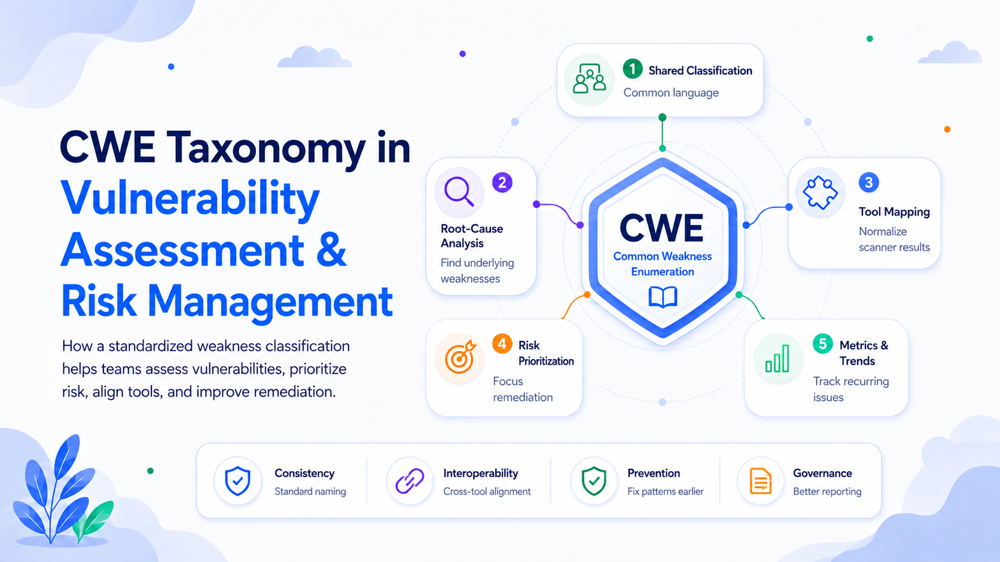

# CWE Taxonomy: A Common Language for Vulnerability Assessment and Risk Management

Security teams collect findings from testing tools, code reviews, penetration tests, bug bounty programs, incidents, and vendor advisories. These sources often describe the same underlying problem in different words. Without a common classification model, comparing results, finding recurring causes, and deciding where to invest become difficult.

The Common Weakness Enumeration, or CWE, addresses this problem. CWE is a community-developed catalog of standardized software and hardware weakness types. A **weakness** is an underlying condition that can contribute to vulnerabilities; a **vulnerability** is a specific, exploitable instance of one or more weaknesses in a product.

## What the CWE Taxonomy Contains

Each entry has a stable identifier, such as **CWE-89** for SQL injection or **CWE-787** for an out-of-bounds write. An entry can include a description, consequences, causes, affected technologies, related weaknesses, detection methods, mitigations, and observed examples. CWE is therefore more than a list of labels: it is a structured knowledge base explaining how security defects arise and how they can be prevented.

CWE can be explored through different **views**, which organize weaknesses for perspectives such as software development, research, or hardware design. Categories group entries with shared characteristics, while individual weakness entries describe defect patterns at different levels of abstraction.

This hierarchy serves different audiences. An executive dashboard may show that access-control weaknesses are rising. A development team needs a more precise diagnosis, such as missing authorization or authorization bypass through a user-controlled key.

Classification must still be precise. Categories are organizational groupings, not weaknesses themselves. MITRE discourages mapping real-world vulnerabilities to categories when a more specific root-cause weakness can be identified.

## How CWE Improves Vulnerability Assessment

### Normalizing Findings from Different Tools

Security products use different rule names, severity scales, and descriptions. Mapping findings to CWE identifiers creates a common layer above vendor terminology. A static analyzer, penetration-test report, and vulnerability disclosure can all map a finding to CWE-89 even when their wording differs.

Normalization makes it easier to combine results, remove duplicates, compare scanners, and correlate findings across applications, business units, and suppliers. CWE-compatible products are expected to expose identifiers and document the CWE version used for mapping, improving transparency and portability.

### Moving from Symptoms to Root Causes

A useful assessment should determine not only where exploitation is possible, but why. CWE encourages analysts to classify the underlying design or implementation weakness rather than only the attack method or visible impact.

Suppose an attacker retrieves another customer’s records through an API. The symptom is data exposure. The cause might be missing authorization or reliance on a user-controlled identifier. Fixing one endpoint closes one ticket; correcting the shared authorization pattern may prevent the weakness across many services.

Root-cause classification improves remediation by connecting an operational vulnerability to the engineering decision that created it.

### Measuring Assessment Coverage

CWE can serve as a coverage model. Teams can map requirements, test cases, scanner rules, and review procedures to weakness types, then determine which high-risk CWEs are tested, which rely entirely on automation, which require architecture review, and which technologies have limited coverage.

This is more defensible than claiming an application was “fully tested.” The organization can state which weakness classes were evaluated, by which methods, and with what limitations.

### Producing Clearer Reports

A CWE identifier gives stakeholders a stable reference. Developers can consult technical details and mitigations. Security leaders can aggregate findings. Auditors can trace scanner results to a recognized classification. Procurement teams can compare vendor coverage.

Terms such as “validation issue” or “access problem” are too broad for reliable analysis. Precise CWE mapping reduces ambiguity and makes results easier to reproduce.

## How CWE Supports Risk Management

CWE does not replace a risk score. It identifies **what type of weakness exists**, while risk also depends on exploitability, exposure, asset criticality, data sensitivity, threat activity, existing controls, and operational impact. CWE adds a consistent analytical dimension that can be combined with those factors.

### Revealing Systemic Risk

A single vulnerability may be severe, but repeated instances of one CWE may reveal a larger engineering problem. Ten missing-authorization findings across several services can indicate a weak access-control architecture or an absent secure-development standard. Even when each finding has moderate severity, the pattern may justify a strategic remediation program.

Teams can prioritize at two levels:

1. **Instance risk:** Which vulnerabilities require immediate action?
2. **Weakness-class risk:** Which recurring causes generate the greatest volume, severity, or business exposure?

The second level supports reusable controls such as centralized authorization, safer framework components, compiler protections, targeted training, and improved test coverage.

### Enabling Trend Analysis

Standard identifiers make weakness trends measurable. Useful indicators include findings per CWE, recurrence after remediation, average resolution time, percentage detected before production, affected critical services, and concentration by team or technology stack.

These metrics are more informative than a raw vulnerability count. A falling total can conceal growth in dangerous weakness types, while a rising total may reflect better testing. CWE-based analysis helps distinguish detection activity from changes in engineering quality.

The annual CWE Top 25 provides external context by ranking prevalent and severe weakness types found in vulnerability data. The 2025 list included cross-site scripting, SQL injection, cross-site request forgery, missing authorization, and out-of-bounds write among its highest-ranked entries. Such rankings can inform assurance priorities, but internal exposure and business impact should remain decisive.

### Supporting Supply-Chain Decisions

CWE can be built into procurement and supplier assurance. Buyers can ask which weakness classes a vendor tests, whether its tools are CWE-compatible, and whether recurring CWE patterns are tracked across releases. For critical systems, contracts may require evidence that selected high-impact CWEs have been assessed. CWE-related frameworks also support software supply-chain risk management.

## Benefits of a Standardized System Like CWE

The central benefit is a **shared technical language**. Developers, testers, researchers, vendors, customers, and governance teams can discuss the same weakness without relying on local terminology. MITRE describes CWE as a common language, a reference mechanism for security tools, and a baseline for weakness identification, mitigation, and prevention.

Standardization also provides:

**Consistency:** Similar findings can be classified uniformly across teams and methods.

**Interoperability:** Results can move between scanners, ticketing systems, dashboards, governance platforms, and vulnerability databases.

**Aggregation and comparison:** Large finding sets can be grouped into weakness families and compared across products, suppliers, projects, and reporting periods.

**Traceability and scale:** Findings can be linked to controls and training, while automation can route work and generate metrics from CWE identifiers.

**Prevention and reuse:** Vulnerabilities can be connected to design and implementation errors, allowing one lesson or control to address the same weakness across many systems.

## Limitations and Good Practice

CWE is only as useful as the quality of its mappings. Broad, inconsistent, or unreviewed tool-generated classifications can distort metrics. Organizations should define mapping rules, prefer root causes over symptoms, record uncertainty, and manually review important findings.

A CWE rank is not a universal risk rating. A Top 25 weakness is not automatically the highest priority in every environment, while a less common weakness may be critical in a specific architecture. CWE should complement contextual risk analysis, not replace it.

Version awareness also matters. The list is updated several times per year, so entries and guidance can change. Recording the version preserves reproducibility. As of June 2026, the CWE site reported version 4.20 and 944 total weaknesses.

## Conclusion

CWE turns disconnected vulnerability findings into a structured view of security engineering failures. In vulnerability assessment, it normalizes tool output, improves root-cause analysis, clarifies reporting, and makes coverage measurable. In risk management, it reveals recurring weakness patterns, supports strategic prioritization, strengthens supplier assurance, and enables trend analysis.

Its greatest advantage is standardization. By giving diverse stakeholders a stable vocabulary and taxonomy, CWE helps organizations move beyond counting vulnerabilities toward understanding—and systematically reducing—the weaknesses that create them.
