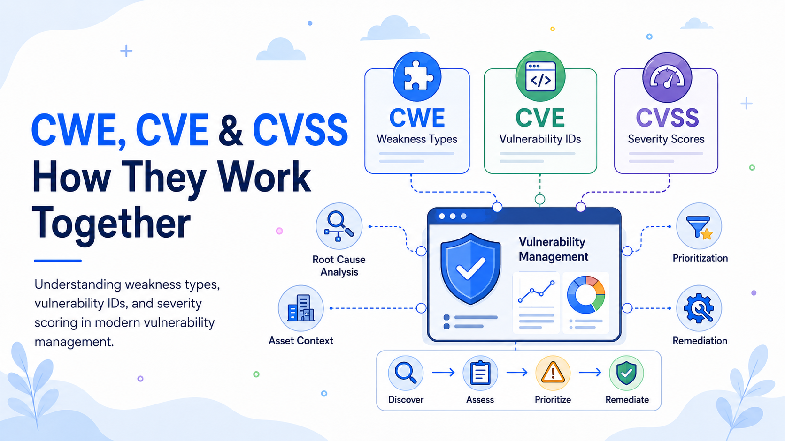

# CWE, CVE, and CVSS: How the Three Frameworks Work Together

CWE, CVE, and CVSS often appear together in scanners, advisories, ticketing systems, and security databases. They are related, but they answer different questions.

**CWE describes the type of weakness**, **CVE identifies a specific publicly disclosed vulnerability**, and **CVSS measures that vulnerability’s technical severity**. Together, they connect software development, vulnerability intelligence, remediation, prioritization, and reporting.

The distinctions matter. A CVE identifier is not a severity rating. A high CVSS score does not automatically equal high business risk. A CWE entry does not prove that a product is vulnerable.

## CWE: The Underlying Weakness

The **Common Weakness Enumeration (CWE)** is a community-developed catalog of software and hardware weakness types. MITRE describes a weakness as a condition that, under certain circumstances, can contribute to vulnerabilities. Examples include SQL injection, missing authorization, out-of-bounds writes, and use-after-free conditions.

CWE operates at the pattern level. It helps answer:

* What kind of design or implementation error occurred?
* What practice could have prevented it?
* Is the same weakness recurring across products or teams?

One CWE can describe the cause behind many vulnerabilities in unrelated products. This makes it useful for secure coding standards, architecture reviews, static analysis, developer education, and root-cause analysis.

## CVE: The Specific Vulnerability

The **Common Vulnerabilities and Exposures (CVE)** Program identifies, defines, and catalogs publicly disclosed cybersecurity vulnerabilities. Each CVE Record receives a unique identifier, such as `CVE-2026-12345`, so vendors, researchers, tools, customers, and regulators can refer to the same vulnerability consistently.

CVE answers:

> Which specific disclosed vulnerability are we discussing?

A CVE ID acts as a correlation key across advisories, scanner findings, patches, software bills of materials, and vulnerability-management platforms. It reduces ambiguity when different sources describe the same issue differently.

CVE does not determine severity, prove exposure, or establish remediation priority. It provides identity and a baseline record. Other data adds affected-product details, weakness classifications, scores, exploit evidence, and mitigations. Findings such as internal defects or configuration errors may require internal identifiers instead.

## CVSS: Technical Severity

The **Common Vulnerability Scoring System (CVSS)** is an open framework maintained by FIRST. It captures technical characteristics of a vulnerability and produces a numerical severity score, normally paired with a rating such as low, medium, high, or critical.

CVSS answers:

> How technically severe is this vulnerability under the stated assumptions?

A score is accompanied by a **vector string** containing the metric values used in the calculation. The vector often matters more than the number alone because similar scores can represent different privileges, attack paths, user-interaction requirements, and impacts.

CVSS version 4.0 organizes metrics into Base, Threat, Environmental, and Supplemental groups. Base metrics capture intrinsic characteristics, Threat metrics reflect factors such as exploitation maturity, Environmental metrics adapt the result to a specific environment, and Supplemental metrics add context without changing the final score.

The key limitation is that **CVSS measures severity, not risk**. NIST explicitly makes this distinction. A critical vulnerability on an isolated test system may be less urgent than a lower-scoring flaw on an internet-facing identity service.

## The Relationship: Type, Instance, and Severity

The frameworks form three connected layers:

| Framework | Role                         | Question answered                     |
| --------- | ---------------------------- | ------------------------------------- |
| CWE       | Weakness classification      | What type of flaw caused the problem? |
| CVE       | Vulnerability identification | Which disclosed vulnerability is it?  |
| CVSS      | Severity assessment          | How technically severe is it?         |

Suppose a web application sends unsanitized input to a database query. The disclosed vulnerability receives a CVE ID, analysts map it to a SQL-injection CWE, and a CVSS vector describes reachability, privileges, user interaction, and potential impact.

The relationship is not one-to-one. One CWE may be associated with many CVEs because the same weakness can recur across products. A CVE may map to one or more CWE entries, or to an unknown category when evidence is incomplete. Different sources may also publish different CVSS vectors when their assumptions differ.

The US National Vulnerability Database shows how these frameworks are combined. After publication, NVD may enrich a CVE with CWE classification, CVSS metrics, references, and affected-product applicability data.

## Building a Stronger Vulnerability Management Strategy

### 1. Use CVE as the Identity Layer

Use CVE IDs to normalize findings and connect scanner output with advisories, patches, mitigations, and threat intelligence. This prevents duplicate tickets and helps security, infrastructure, and application teams discuss the same issue.

The CVE should remain the reference key, not the complete decision record. Teams must still determine whether affected versions are installed, whether the vulnerable function is enabled, and whether the asset is reachable.

### 2. Use CWE to Find Systemic Causes

A program centered only on CVEs can become a patching operation: find the asset, deploy an update, and close the ticket. CWE adds a prevention layer.

Aggregating findings by CWE exposes recurring engineering failures. Repeated authorization weaknesses may indicate poor access-control design. Frequent injection flaws may reveal missing safe-query standards or ineffective testing. Memory-safety issues may justify safer libraries or language modernization.

This shifts vulnerability management from fixing individual instances toward reducing the conditions that create future vulnerabilities.

### 3. Use CVSS as a Severity Baseline

CVSS provides a standardized starting point for triage. Scores support broad sorting, while vectors enable more precise decisions. Teams can distinguish remotely exploitable flaws requiring no privileges from local flaws requiring authenticated access, even when both share the same rating.

CVSS should not become an automatic service-level agreement. Always fixing CVSS 9.0–10.0 items before lower-scoring vulnerabilities ignores exposure, exploit activity, asset value, controls, and operational consequences.

### 4. Add Threat, Asset, and Business Context

For each relevant CVE, determine whether the affected version is deployed, whether the component is reachable, whether exploitation is active, which privileges are required, which services are at risk, and whether compensating controls reduce exposure.

CVSS Threat and Environmental metrics can formalize part of this adjustment. Many organizations also calculate an internal priority score. The result should remain explainable: analysts should be able to show how CVE identity, CWE classification, CVSS severity, asset context, threat evidence, and business impact produced the decision.

### 5. Automate Enrichment, Not Judgment

A practical pipeline can ingest CVE records and vendor advisories, add CWE and CVSS data, match affected products against the asset inventory, and create remediation work. NVD provides standards-based data intended to support vulnerability-management automation.

Automation should expose uncertainty. Missing CWE mappings, conflicting scores, incomplete version data, and disputed applicability should trigger review. Systems should retain source and timestamp information because records may change as new evidence appears.

### 6. Measure Remediation and Prevention

Useful measures include open and overdue CVEs, exposure age, remediation time by CVSS severity, recurring CWE classes, and defect trends by product or team.

This is more informative than reporting only the number of critical vulnerabilities. A shrinking CVE backlog may look positive while the same CWE categories continue to appear in every release.

## A Practical Workflow

An organization can apply the frameworks in sequence:

1. **Identify and validate:** Correlate the CVE, then confirm versions, configurations, reachability, and affected assets.
2. **Classify:** Use CWE to understand the underlying weakness.
3. **Assess:** Review the CVSS score and vector.
4. **Prioritize:** Add threat activity, asset importance, controls, and business impact.
5. **Remediate and verify:** Patch, mitigate, isolate, remove, or formally accept the risk, then confirm the outcome.
6. **Prevent recurrence:** Feed CWE trends into architecture, coding, testing, training, and reporting.

## Conclusion

CWE, CVE, and CVSS are complementary standards. **CVE provides identity, CWE provides cause-oriented classification, and CVSS provides a standardized assessment of technical severity.**

Used separately, they provide partial answers. Used together—and combined with threat, asset, and business context—they support defensible prioritization, consistent communication, efficient remediation, and long-term prevention. That is the difference between a reactive patch queue and a mature vulnerability-management strategy.
