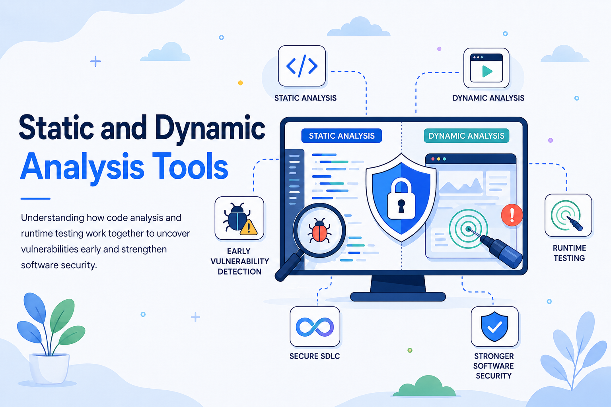

# Static and Dynamic Analysis Tools: Two Essential Layers of Software Security

Modern software rarely operates in isolation. Applications communicate with cloud platforms, third-party services, databases, mobile devices, internal networks, and open-source components. Each connection expands functionality, but it also increases the number of places where a security weakness can appear.

Developers and security teams therefore need practical ways to identify vulnerabilities before attackers can exploit them. Two of the most important approaches are **static analysis** and **dynamic analysis**.

Static analysis examines software without running it. Dynamic analysis evaluates the software while it is executing. These approaches view an application from different perspectives, detect different categories of problems, and become significantly more effective when used together.

Understanding their respective strengths is fundamental to building a mature application security program.

## What Is Static Analysis?

Static analysis examines source code, bytecode, binaries, configuration files, or other software artifacts without executing the application.

In application security, this approach is commonly called **Static Application Security Testing**, or **SAST**. A SAST tool analyzes the internal structure of an application and searches for patterns that may indicate security defects.

Depending on the tool, static analysis may inspect:

* Data flows between inputs and sensitive operations
* Control-flow paths through the application
* Function calls and variable usage
* Authentication and authorization logic
* Memory allocation and pointer operations
* Error-handling routines
* Cryptographic functions
* Configuration values and embedded secrets
* Violations of secure coding rules

For example, suppose a web application reads a value from an HTTP request and inserts it directly into a database query. A static analysis tool may trace the data from the user-controlled input to the database function and report a potential injection vulnerability.

The tool does not need to launch the web application or connect to the database. It identifies the risky path by analyzing the code.

This ability makes static analysis particularly valuable early in the software development lifecycle, when developers can correct defects before the application reaches production.

## What Is Dynamic Analysis?

Dynamic analysis examines an application while it is running.

In application security, this is often called **Dynamic Application Security Testing**, or **DAST**. Instead of inspecting source code, a dynamic tool interacts with the application from the outside. It sends requests, manipulates inputs, observes responses, and searches for behavior that indicates a vulnerability.

A dynamic analysis tool may test:

* Web forms and API endpoints
* Authentication workflows
* Session management
* Input-validation controls
* Server and framework configurations
* Error messages and information exposure
* Transport-layer protections
* Access-control boundaries
* Runtime handling of malformed or malicious data

For example, a DAST scanner might submit specially constructed input to a search field and monitor the resulting response. If the server returns a database error, exposes internal data, or behaves unexpectedly, the scanner may identify a possible injection vulnerability.

Dynamic analysis evaluates the application as a functioning system. It can therefore reveal problems that become visible only when multiple components—such as application code, web servers, databases, authentication services, and infrastructure settings—interact at runtime.

## Static Analysis Versus Dynamic Analysis

The simplest distinction is one of perspective.

**Static analysis looks inside the software. Dynamic analysis observes the software from the outside while it runs.**

Static tools generally have access to implementation details. They can identify the relevant file, function, method, or line of code associated with a potential vulnerability. Dynamic tools typically see the application as a user or attacker would see it, through exposed interfaces and runtime behavior.

The two approaches also differ in timing.

Static analysis can begin as soon as code exists. Developers can run it on individual commits, pull requests, or local development environments. Dynamic analysis usually requires a deployable and operational version of the application, along with any supporting services needed to exercise its functionality.

They also produce different types of evidence. A static tool may report that a vulnerable code path appears to exist. A dynamic tool may demonstrate that the behavior can actually be triggered in a running environment.

Neither perspective is complete by itself.

## Why Analysis Tools Are Essential for Software Security

Manual security reviews remain valuable, particularly for complex business logic and high-risk functionality. However, modern codebases are often too large, interconnected, and frequently updated to rely on manual review alone.

A single application may contain millions of lines of code, hundreds of dependencies, dozens of APIs, and multiple deployment configurations. Development teams may release changes daily or even several times per day.

Automated analysis tools provide several important benefits.

### Earlier Vulnerability Detection

Security defects become more expensive to fix as they move through the SDLC. A coding mistake found while a developer is working on a feature may require only a small correction. The same mistake discovered after release may involve emergency patches, incident response, customer communication, regulatory review, and operational disruption.

Static analysis helps move security testing closer to the point where code is written. Dynamic analysis validates security behavior in test, staging, or production-like environments.

Together, they reduce the likelihood that vulnerabilities will survive until deployment.

### Consistent Security Checks

Human reviews vary according to experience, time, and attention. Automated tools apply the same rules repeatedly across large codebases and frequent releases.

This consistency is particularly useful for identifying recurring weakness patterns, such as unsafe function calls, missing validation, insecure cryptographic choices, or improperly configured security headers.

### Scalable Testing

Security teams are rarely large enough to review every code change manually. Analysis tools allow security controls to scale across multiple applications and development teams.

Automation does not eliminate the need for security expertise. It allows specialists to concentrate on architecture, threat modeling, complex findings, and high-impact risks rather than repeatedly searching for routine coding errors.

### Developer Feedback

Well-integrated tools provide developers with actionable feedback while code is still fresh in their minds. A useful finding identifies the affected code, explains the weakness, estimates its severity, and suggests a remediation approach.

This turns security testing into part of normal engineering work rather than a separate review performed immediately before release.

## Historical Development of Analysis Tools

The foundations of static analysis are closely connected to compiler theory, formal methods, and program verification.

Early compilers already needed to inspect source code without executing it. They analyzed syntax, data types, control flow, and variable usage to determine whether programs were valid and how they should be translated into machine instructions.

Researchers later extended similar techniques to reason about software correctness. Methods such as control-flow analysis, data-flow analysis, symbolic execution, and abstract interpretation made it possible to identify potential defects by modeling program behavior.

Early security-focused static tools were often narrow and rule-based. They searched for dangerous functions, suspicious coding patterns, or common programming mistakes. Modern tools may perform interprocedural analysis across multiple functions, trace untrusted data through complex systems, and use contextual models to reduce inaccurate findings.

Dynamic analysis also has roots in traditional software testing and debugging. Developers have long executed programs to observe failures, measure performance, and inspect memory behavior.

Security-oriented dynamic testing developed as professionals began applying attacker-like inputs to running systems. Early web scanners focused on common server weaknesses, exposed files, unsafe parameters, and known misconfigurations. As web applications became more interactive, dynamic tools expanded to support authentication, session management, API testing, client-side behavior, and modern application frameworks.

The role of both approaches changed further with the adoption of agile development, continuous integration, continuous delivery, cloud infrastructure, containers, microservices, and DevSecOps.

Security testing was once treated primarily as a final checkpoint. Today, effective programs distribute security analysis throughout the development process. Static tests may run on every pull request, while dynamic scans execute automatically against staging environments after deployment.

The tools have therefore evolved from isolated specialist utilities into components of automated software delivery pipelines.

## How Static Analysis Tools Work

Static analysis tools use several techniques, often in combination.

### Pattern and Rule Matching

The simplest form of static analysis searches for known risky constructs. A tool may flag hard-coded passwords, deprecated cryptographic functions, unsafe memory operations, or functions associated with command execution.

Pattern matching is fast, but limited. A suspicious function may be safe in one context and dangerous in another.

### Control-Flow Analysis

Control-flow analysis models the paths that execution can take through a program. It helps the tool understand branches, loops, error conditions, and function calls.

This is important because a vulnerability may appear only on a particular execution path.

### Data-Flow and Taint Analysis

Data-flow analysis tracks how values move through the application. Security-focused tools often perform **taint analysis**, which follows data from an untrusted source to a sensitive destination.

An HTTP parameter may be treated as a source of untrusted data. A database query, operating-system command, file path, or HTML response may be treated as a sensitive sink.

If untrusted data reaches a sink without appropriate validation or encoding, the tool reports a possible vulnerability.

### Semantic Analysis

More advanced tools attempt to understand the meaning of code rather than merely its syntax. They may recognize framework-specific protections, sanitization functions, authentication controls, or safe database interfaces.

Semantic awareness can improve accuracy, although it requires deeper language and framework support.

## Where Static Analysis Is Most Effective

Static analysis is especially effective when the security problem is visible in code structure or data flow.

Common examples include:

* SQL injection paths
* Command injection risks
* Cross-site scripting caused by unsafe output handling
* Path traversal
* Buffer overflows and memory-safety problems
* Insecure deserialization
* Hard-coded credentials or cryptographic keys
* Weak or deprecated cryptography
* Missing authorization checks
* Unsafe API usage
* Exposure of sensitive data in logs
* Race conditions and resource-management errors

Consider a service that receives a filename from a user and passes it directly to a file-opening function. Static analysis may identify that an attacker-controlled value reaches the filesystem without normalization or restriction. The finding may point developers directly to the vulnerable method.

Static analysis is also valuable for reviewing code that is difficult to exercise dynamically. Rare error paths, background jobs, dormant functionality, and low-frequency administrative operations may not be reached during a normal dynamic scan, but their code can still be inspected statically.

However, static analysis has limitations. It may generate false positives, particularly when it cannot understand custom validation logic or complex framework behavior. It may also struggle with runtime-generated code, reflection, external services, or configuration-dependent behavior.

A reported code path is not always exploitable in the deployed application.

## How Dynamic Analysis Tools Work

Dynamic tools generally interact with an application through its exposed interfaces.

A typical web or API scanner begins by discovering available functionality. It may crawl links, inspect forms, analyze API specifications, monitor browser traffic, or import recorded requests.

The tool then sends modified requests designed to test security controls. These requests may contain unexpected characters, oversized values, encoded payloads, invalid tokens, malicious scripts, or values intended to alter backend commands.

The scanner compares the application’s responses with expected behavior. Indicators of a weakness may include:

* Different responses for manipulated inputs
* Database or framework error messages
* Unexpected redirects
* Unauthorized access to data
* Reflected script content
* Changes in response timing
* Server crashes or connection resets
* Missing security headers
* Weak cookie attributes
* Acceptance of expired or invalid credentials

Because the application is running, dynamic analysis can evaluate the combined effect of code, configuration, infrastructure, and external components.

## Where Dynamic Analysis Is Most Effective

Dynamic analysis is particularly effective for identifying vulnerabilities that are observable through application behavior.

Examples include:

* Exploitable injection vulnerabilities
* Authentication failures
* Session-management weaknesses
* Security header misconfigurations
* Cross-site scripting
* Server information disclosure
* Improper error handling
* Exposed administrative interfaces
* Weak transport security
* Access-control problems
* Vulnerable API endpoints
* Runtime configuration errors

Suppose an API contains authorization checks in the source code, but a routing error allows one endpoint to bypass them. Static analysis might not recognize the deployment-specific route. A dynamic tool can request the endpoint using a low-privilege account and observe whether restricted data is returned.

Dynamic testing can also provide strong evidence that a vulnerability is reachable. A confirmed runtime response is often easier to prioritize than a theoretical code-level warning.

Its limitations are equally important. A dynamic scanner can usually test only the functionality it can discover and reach. It may miss hidden endpoints, complex workflows, asynchronous operations, or features that require specialized data.

Dynamic tools also have limited visibility into root causes. They may identify a vulnerable parameter but not the exact function responsible for processing it.

Testing depth depends heavily on configuration, authentication, application coverage, and the realism of the test environment.

## Integrating Analysis into Development Workflows

Analysis tools are most effective when integrated into engineering workflows rather than reserved for occasional security assessments.

### During Development

Developers can run lightweight static checks in their code editors or local build environments. Fast rules can identify defects before code is committed.

The goal at this stage is immediate feedback. Checks should be quick, relevant, and easy to understand.

### During Code Review

More comprehensive static analysis can run when a pull request is created. The system can examine changed code, compare new findings against an established baseline, and block merging when severe vulnerabilities are introduced.

Focusing on newly introduced findings helps teams avoid overwhelming developers with historical security debt.

### During Continuous Integration

Full SAST scans can run as part of the build pipeline. Results can be sent to defect trackers, security dashboards, or application security management platforms.

Policies may require teams to resolve critical findings before a release can proceed.

### In Test and Staging Environments

Dynamic scans can run after the application is deployed to a controlled environment. Authenticated scans should be configured to cover functionality available to different user roles.

Teams may perform fast scans for every deployment and deeper scans on a scheduled basis or before major releases.

### In Production-Like Environments

Some vulnerabilities appear only when realistic infrastructure, identity systems, data flows, and configuration settings are present. A production-like environment can reveal problems that simplified test environments do not reproduce.

Testing must be controlled to avoid damaging data, disrupting services, or triggering operational safeguards.

## Managing Findings Effectively

Installing a scanner is not the same as establishing an effective security practice.

Both static and dynamic tools can produce inaccurate, duplicated, or low-value results. Mature programs therefore need a structured process for validation and remediation.

Findings should be evaluated according to:

* Technical severity
* Exploitability
* Internet exposure
* Data sensitivity
* Required attacker access
* Existing compensating controls
* Business impact
* Availability of a safe remediation
* Confidence in the tool’s evidence

A critical-looking static result may be unreachable in the deployed application. A medium-severity dynamic finding may be highly important if it exposes sensitive customer information.

Risk-based triage is more effective than treating every scanner alert equally.

Teams should also establish ownership. Developers need to know which findings they are responsible for, security specialists need a process for reviewing uncertain results, and engineering leaders need visibility into unresolved risks.

## Why Static and Dynamic Analysis Work Better Together

Static and dynamic analysis are complementary because each compensates for limitations in the other.

Static analysis provides broad visibility into the codebase. It can inspect paths that may be difficult to reach in testing and identify the internal location of a defect. Dynamic analysis validates the behavior of the running application and detects weaknesses created by configuration, deployment, or component interaction.

Consider a potential SQL injection flaw.

A static tool may trace an HTTP parameter to a query-building function and identify the exact source file and line. However, it may not know whether another runtime control prevents exploitation.

A dynamic tool may submit an injection payload and demonstrate that the database query can be manipulated. However, it may not identify the precise code path that should be corrected.

Together, the findings provide both implementation context and runtime evidence.

The same principle applies to access control. Static analysis can reveal missing authorization checks in a method. Dynamic analysis can test whether a user with insufficient privileges can actually invoke that method through an exposed endpoint.

Correlation between tools can also improve prioritization. When a static finding and a dynamic finding point to the same weakness, confidence in the result increases.

## Beyond SAST and DAST

Static and dynamic analysis are foundational, but they are not the only forms of automated security testing.

**Software Composition Analysis**, or SCA, identifies known vulnerabilities and licensing risks in third-party dependencies.

**Interactive Application Security Testing**, or IAST, observes an application from within the runtime while automated or manual tests are being performed. It combines elements of code-level visibility and dynamic execution.

**Runtime Application Self-Protection**, or RASP, monitors application behavior during execution and may block malicious activity.

**Fuzz testing** sends large volumes of unexpected or malformed data to software in an attempt to trigger crashes, memory errors, or other abnormal behavior.

**Infrastructure-as-code scanning** examines cloud and deployment definitions for insecure configurations.

These techniques address different layers of the technology stack. They should not be viewed as interchangeable products competing for a single security-testing slot. Effective application security uses multiple controls, each selected for the risks it can observe.

## Building a Balanced Analysis Strategy

A practical security program does not attempt to run every possible test with maximum depth on every code change. That approach would create excessive delays and unmanageable alert volumes.

Instead, teams can use a layered strategy.

Fast static checks should run frequently and provide immediate feedback. Deeper static scans can run during integration or before release. Lightweight dynamic checks can validate each deployed build, while comprehensive authenticated scans run at defined intervals.

Higher-risk applications should receive stronger controls. An internet-facing financial platform requires greater testing depth than an internal informational tool with no sensitive data.

Tool selection should also reflect the languages, frameworks, architectures, and deployment models used by the organization. A scanner with excellent support for one technology stack may perform poorly on another.

Finally, automated analysis should be supported by secure design reviews, threat modeling, penetration testing, code review, dependency management, developer education, and incident learning. Tools are force multipliers, not substitutes for sound engineering judgment.

## Conclusion

Static and dynamic analysis provide two distinct but complementary views of software security.

Static analysis examines software artifacts without executing the application. It is well suited to early detection, code-level data-flow analysis, secure coding enforcement, and precise remediation guidance.

Dynamic analysis tests the running application from an external perspective. It is effective for validating exploitable behavior, identifying runtime and configuration weaknesses, and examining the way deployed components interact.

Static analysis can explain where a weakness may exist. Dynamic analysis can show how the application behaves when that weakness is tested.

Used independently, each approach leaves important blind spots. Integrated throughout the SDLC, they provide broader coverage, faster feedback, and stronger evidence for security decisions.

The objective is not simply to run more scanners. It is to place the right form of analysis at the right stage, connect findings to development workflows, and ensure that identified risks are validated and corrected.

In the next article in this series, we will move from analysis methods to a specific and persistent application security threat: **injection attacks**. We will examine how untrusted input alters commands and queries, why injection vulnerabilities continue to appear in modern systems, and which design and implementation practices can prevent them.
