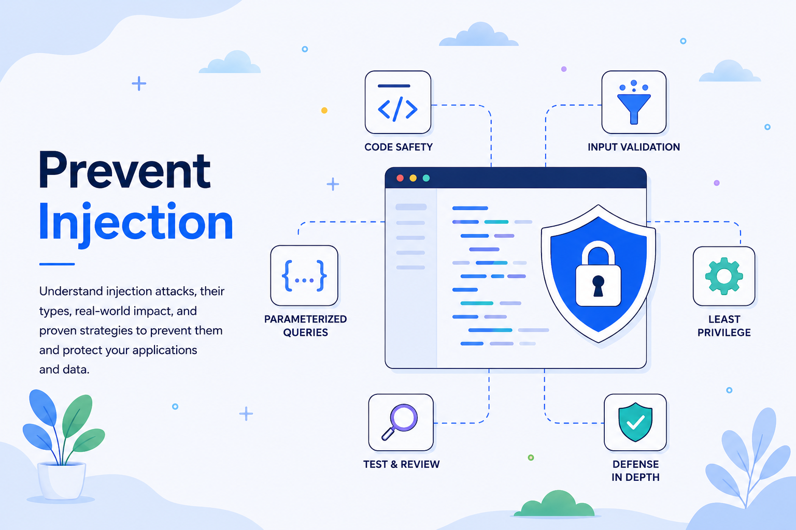

# Prevent Injection: Keep Data Separate from Commands

Injection attacks are among the most damaging application-security failures because they exploit a basic boundary error: a system treats attacker-controlled data as part of a command, query, expression, or instruction. A search term becomes SQL syntax. A filename becomes a shell command. A profile field becomes template code. Once that boundary collapses, an attacker may bypass authentication, expose or alter restricted data, execute commands, or compromise a server.

The problem extends beyond relational databases. Injection can occur wherever software passes data to an interpreter, including SQL and NoSQL databases, directory services, operating-system shells, template engines, XML processors, spreadsheets, logging systems, and AI agents. OWASP’s current Top 10 places Injection at A05:2025 and identifies the central defense: keep data separate from commands and queries. MITRE’s 2025 CWE Top 25 also includes OS command injection and code injection among the most dangerous software weaknesses.

## How Injection Attacks Work

Most injection flaws follow the same pattern:

1. An application receives data from an untrusted or insufficiently trusted source.
2. It combines that data with executable syntax.
3. An interpreter processes the resulting query, command, or expression.
4. The interpreter cannot distinguish intended instructions from hostile input.

Input may arrive through forms, APIs, headers, uploads, queues, stored records, or internal tools. Data that is harmless in one component may become dangerous when another interprets it, so client-side checks are never sufficient.

## Major Types of Injection Attacks

### SQL Injection

SQL injection occurs when input changes the structure or meaning of a relational-database query. Common exposure points include login forms, search filters, reporting tools, account portals, and administrative dashboards.

A login endpoint that concatenates credentials into SQL may allow crafted input to change the query’s logic. A search filter might expose another customer’s records, while an injectable reporting endpoint could permit unauthorized reading or modification.

Consequences include authentication bypass, sensitive-data disclosure, and record corruption. Impact often depends on the database account’s permissions.

### NoSQL Injection

NoSQL databases use different query models, but they are not immune. Vulnerabilities arise when user-controlled objects, operators, or expressions enter document, key-value, graph, or search queries.

A JSON API may expect an email address as a string but accept a structured object. Without schema enforcement, that object could introduce a comparison operator and broaden the match. A search service that accepts raw filter syntax may expose records beyond the user’s authorization scope.

NoSQL injection often involves unsafe parsing rather than concatenation. Applications must validate values and types, reject unexpected operators, and use safe driver APIs. Payloads may be evaluated in the application or database layer.

### OS Command Injection

OS command injection appears when an application incorporates untrusted data into a command executed by a shell or operating-system process. Risk areas include file conversion, image processing, backup tools, network diagnostics, document generation, and deployment automation.

A support tool might run a network utility using a user-supplied hostname. If it builds a shell string, crafted input may append another command. A media service that sends an unsafe filename to a command-line converter creates a similar risk.

Because the attack crosses into the host operating system, it may expose secrets, alter files, or enable lateral movement. Avoid the shell when a library or narrowly scoped API can perform the task; OWASP recommends built-in functions over direct OS commands.

### LDAP and XPath Injection

LDAP injection targets directory queries used by login, identity, and access-control systems. Raw input inserted into a filter may alter a match or select an unintended account. XPath injection applies the same concept to XML queries, where manipulated input can change node selection or bypass a condition. The root cause remains the same: untrusted values become interpreter syntax.

### Template, Expression, and Code Injection

Applications use templates to generate web pages, emails, documents, and configuration files. Server-side template injection occurs when user input is evaluated as template source instead of rendered as ordinary content.

If a marketing preview or document generator evaluates submitted text as a template, an attacker may access server-side objects or invoke template functions. Depending on the engine and sandbox, impact ranges from information disclosure to remote code execution.

Expression languages, `eval`, scripting hooks, and loosely constrained rules engines create the same risk by converting data into executable behavior.

### Header, Log, and CSV Injection

Injection also appears downstream. Untrusted values can corrupt HTTP or email headers, forge log lines, or become spreadsheet formulas in CSV exports. Safety is context-specific: a value harmless in a database may be dangerous in a shell command, header, log, HTML document, or spreadsheet cell.

### Prompt Injection in AI Systems

LLM prompt injection has a distinct cause: AI applications often process instructions and data in the same natural-language channel. A malicious document, web page, email, or message may tell a model to ignore policy, disclose information, or misuse connected tools.

Risk increases when an agent can access private data or perform actions. Because natural language has no reliable syntax boundary, mitigation requires restricted tool permissions, isolated context, validated outputs, and confirmation for consequential actions.

## Preventing Injection Attacks

### Separate Data from Executable Structure

The strongest defense is to use interfaces that preserve the distinction between code and data.

For SQL, use prepared statements and parameterized queries. Bind values through the database driver instead of assembling query strings. Apply the same principle to NoSQL drivers, LDAP libraries, and structured query builders: define the query structure in code, then supply validated values through supported APIs.

Structural elements such as table names, sort directions, and operators should come from strict allowlists. Stored procedures are safe only when they avoid dynamic query construction.

### Avoid Unnecessary Interpreters

Every interpreter expands the attack surface. Prefer a filesystem API over a shell command, a native library over a command-line pipeline, a structured serializer over hand-built XML, and a fixed template over runtime evaluation.

Remove dynamic execution where possible. If scripting is required, use a constrained language and sandbox it with strict resource and access limits. Avoiding direct interpreter access is generally stronger than attempting to sanitize every possible payload.

### Validate Input Positively

Define what is allowed rather than trying to recognize every malicious payload. Check type, length, format, range, character set, and permitted values. Reject objects where a scalar is expected, and normalize input before validation.

Use allowlists for fields such as sort order, file type, and operation name. Validation is defense in depth, not a replacement for parameterization.

### Encode for the Exact Destination

When parameterization is unavailable, use a maintained escaping or encoding function designed for the target context. LDAP filters and distinguished names require different rules. HTML text, attributes, JavaScript strings, URLs, shell arguments, headers, logs, and spreadsheet cells also require distinct handling.

A generic “sanitize” function is not enough. Escaping should remain secondary to safe APIs and constrained input.

### Limit Privileges and Contain Failure

Assume a control may fail. Database accounts, application processes, containers, and service identities should have only the permissions and access they require. Least privilege can prevent one injectable endpoint from becoming a full-system compromise.

A public application may need permission to read and update customer records, for example, but it should not be able to create database administrators or access unrelated datasets. A document-conversion service should not have unrestricted network access or broad access to application secrets.

### Make Secure Framework Features the Default

Modern frameworks provide prepared queries, ORM binding, schema validation, template auto-escaping, and safer process-execution APIs. These protections fail when developers bypass them through raw queries, unsafe rendering, string-built filters, or shell-enabled calls.

Create secure wrappers, deprecate dangerous APIs, enable security linters, and require review for exceptions. Make the safe implementation the easiest one.

Teams should also document approved query, templating, process-execution, and serialization patterns. This reduces inconsistency and prevents each developer from inventing a separate security solution.

### Test Throughout Development

Use several testing methods because no single tool sees every data flow:

* **Static application security testing:** SAST can identify unsafe string construction near query, command, and evaluation sinks.
* **Dynamic application security testing:** DAST can probe running applications for observable injection behavior.
* **Unit and integration testing:** Tests should cover malformed types, control characters, boundary values, and interpreter metacharacters.
* **Manual review and threat modeling:** Review database execution, process creation, template compilation, directory queries, dynamic evaluation, exports, automation, and AI tool use.

Scanners may still miss custom query builders, stored injection, and business-specific interpreters. Security reviews should therefore trace data from its original trust boundary to every location where it may be interpreted.

### Monitor, but Do Not Depend on a WAF

Log rejected input, query failures, unusual operators, repeated syntax errors, unexpected process launches, and anomalous data access. Use structured logging so attacker-controlled values remain fields rather than preformatted lines.

A web application firewall can block known patterns and provide telemetry, but it is not the primary fix. Secure code removes the cause; filtering adds another layer.

Blocking individual attack strings is inherently fragile. Attackers can change encoding, syntax, data types, or delivery paths. A WAF may reduce exposure while a vulnerability is being remediated, but it should not become a permanent substitute for parameterization, validation, and safe architecture.

## Engineering Checklist

Before releasing a feature that processes external data, confirm that:

* Queries use parameterized APIs rather than concatenated strings.
* Dynamic identifiers and operations come from allowlists.
* Shell invocation is eliminated or avoids a command interpreter.
* Templates render user content as data, not template source.
* Schemas reject unexpected types, fields, and operators.
* Output is encoded for its precise destination.
* Database, service, and operating-system privileges are minimal.
* Tests cover direct, stored, and second-order injection paths.
* Logs can reveal attacks without becoming injectable.
* AI tools have scoped permissions and reviewable actions.

Injection defenses should also be included in code-review checklists, development standards, automated pipelines, and architecture reviews. Preventing injection is considerably easier when secure boundaries are designed into a system rather than added after deployment.

## Conclusion

Injection is not a single SQL-related bug. It is a family of boundary failures in which untrusted content enters a control plane: database syntax, operating-system commands, directory filters, templates, expressions, document formulas, or AI instructions. The technologies differ, but the engineering lesson is consistent.

Robust prevention starts by removing unnecessary interpreters and structurally separating commands from data. Parameterized APIs, strict schemas, allowlisted operations, context-specific encoding, least privilege, secure framework defaults, testing, and monitoring provide layered protection. Filtering tools may reduce exposure, but they cannot compensate for unsafe construction at the source.

Addressing injection early protects more than individual records. It preserves the integrity of authentication, transactions, automation, infrastructure, and the trust users place in systems that manage sensitive data.

In the next article, we will take a deep dive into **Cross-Site Request Forgery (CSRF)**—how attackers exploit a browser’s authenticated state to trigger unwanted actions, and how anti-CSRF tokens, SameSite cookies, origin validation, and secure interaction design prevent forged requests.
