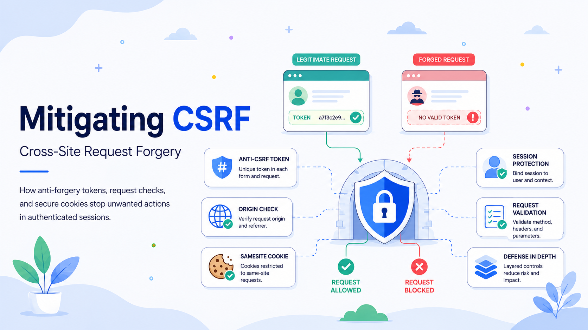

# Mitigating CSRF: How to Stop the Browser from Betraying the User

A user signs in to an administrative dashboard, opens another tab, and visits a seemingly harmless page. Hidden inside it is a form that submits a request to the dashboard: change an email address, add a payment destination, disable multifactor authentication, or delete a project. The browser automatically attaches the user’s session cookie. The vulnerable application sees a valid session and performs the action.

The attacker never learned the password or stole the cookie. They persuaded the browser to use an authenticated session for the wrong purpose.

That is **Cross-Site Request Forgery**, or **CSRF**: an attack in which a hostile site causes a browser to send an unwanted request to an application where the user is already authenticated. The target trusts the session but has not verified the user’s intent. Without specific defenses, it cannot distinguish a legitimate authenticated request from a forged one.

CSRF exploits “ambient authority”: browsers automatically attach eligible cookies to matching requests. Authentication establishes **who the browser is acting as**, not **who initiated this action**. The server needs another signal proving that the request came from its trusted interface.

## How a CSRF Attack Works

A conventional CSRF attack usually needs three conditions:

1. The target exposes a state-changing action, such as updating a profile, transferring funds, or changing permissions.
2. The browser sends authentication automatically, commonly through a session cookie.
3. The request is predictable, and the server requires no secret, request-specific proof.

Consider an application that accepts:

```http
POST /account/email HTTP/1.1
Host: app.example
Content-Type: application/x-www-form-urlencoded
Cookie: session=VALID_USER_SESSION

email=attacker@example.net
```

An attacker can place an auto-submitting form on another site:

```html
<form action="https://app.example/account/email" method="post">
  <input type="hidden" name="email" value="attacker@example.net">
</form>
<script>document.forms[0].submit();</script>
```

When an authenticated user visits the attacker’s page, the browser may send the form and attach eligible cookies. The same-origin policy normally prevents the malicious page from reading the response, but cross-origin form submissions have existed since the early web. Preventing a hostile site from **reading** data is not the same as preventing it from **sending** a state-changing request.

This is why CORS is not automatically a CSRF defense. CORS governs whether JavaScript can access cross-origin responses and whether certain requests pass a preflight. Traditional HTML forms can still send “simple” requests, while an overly broad credentialed CORS policy can increase exposure.

## From “Session Riding” to a Standard Threat Model

CSRF predates modern single-page applications. The issue was discussed under the CSRF name by 2001 and later became known as **session riding**, **one-click attack**, and **XSRF**. A 2004 paper described session riding as a widespread web application weakness.

Early applications were especially vulnerable. Many treated any request carrying a valid cookie as authorized, changed data through `GET` endpoints, and exposed predictable action URLs. An image, iframe, link, or hidden form could trigger a sensitive operation.

Defenses matured in layers: frameworks added anti-forgery middleware, applications adopted cryptographically unpredictable tokens, browsers introduced `SameSite` cookies, and servers gained signals such as Fetch Metadata. CSRF did not disappear; the security model became stronger.

## The Impact of CSRF

The impact depends on the victim’s privileges and the operations exposed.

For an ordinary user, CSRF can modify contact details, create transactions, enroll an attacker-controlled authenticator, publish content, or redirect notifications. It may also disclose data indirectly by adding a webhook or changing where later information is sent.

For an administrator, the same flaw can become application-wide: a forged request might create a privileged account, alter access rules, approve a payment, rotate secrets, or disable a security feature. OWASP notes that CSRF can compromise both user data and application operations, with greater consequences for privileged victims.

The attacker may not read the response, but CSRF still attacks integrity by changing what a trusted system stores or does.

## Start with Correct Request Semantics

**Never use `GET` for state-changing operations.** Safe methods should retrieve information without meaningful side effects. Links, crawlers, image loads, prefetchers, and browser navigation can trigger `GET` requests. Moving an operation to `POST`, `PUT`, `PATCH`, or `DELETE` does not stop CSRF by itself, but it removes trivial attack paths and enables stronger validation.

Inventory every state-changing endpoint, including login, logout, OAuth linking, API-key creation, invitations, and administrative actions. Apply protection centrally through framework middleware. One excluded route can compromise the application.

## Anti-CSRF Tokens: The Primary Control

The standard application-level defense is an **anti-CSRF token**: an unpredictable value that the attacker cannot obtain and that the server requires on state-changing requests.

In the **synchronizer token pattern**, the server generates a cryptographically strong value, associates it with the user’s session, and embeds it in a trusted page. Forms return it in a hidden field; JavaScript clients commonly send it in a custom header such as `X-CSRF-Token`. The server validates it before processing the action.

A secure token should be unpredictable, session-bound, checked on every protected request, and sent in the request body or a custom header—not in a URL where logs, browser history, analytics, or referrer data may expose it.

Per-request tokens reduce replay opportunities but complicate navigation and parallel requests. Per-session tokens are simpler and effective when implemented correctly. Validation must fail closed: missing, expired, or mismatched tokens should be rejected.

Stateless systems can use a **signed double-submit cookie**. The server issues related cookie and request values, then verifies a cryptographic signature tied to session-specific data. Avoid a naive unsigned comparison; cookie injection or subdomain control may undermine it. OWASP recommends signing and session-binding the value.

Prefer the framework’s maintained CSRF implementation. Mature frameworks already handle secure generation, comparison, form helpers, rotation, and edge cases.

## Validate the Request Origin

For HTTPS applications, validate the browser-supplied `Origin` header on state-changing requests against an explicit allowlist. Where `Origin` is absent, a carefully checked `Referer` header can be a fallback.

Compare the complete origin—scheme, host, and port—not a substring. `https://app.example.attacker.net` is not a trusted variation of `https://app.example`.

Use origin validation as defense in depth. Some legitimate clients omit these headers, so define and monitor a policy for missing values.

## Harden Session Cookies

The `SameSite` attribute controls when browsers attach a cookie to cross-site requests:

* `SameSite=Strict` is strongest but can disrupt legitimate journeys from external sites.
* `SameSite=Lax` balances security and usability for many applications.
* `SameSite=None` permits cross-site use and must be paired with `Secure`.

A useful first-party baseline is:

```http
Set-Cookie: __Host-session=...; Path=/; Secure; HttpOnly; SameSite=Lax
```

`Secure` restricts transmission to HTTPS, `HttpOnly` blocks normal JavaScript access, and the `__Host-` prefix imposes stricter host and path requirements in supporting browsers.

Do not treat `SameSite` as a substitute for tokens. “Site” is not identical to “origin,” sibling subdomains can matter, and some integrations require `SameSite=None`. MDN and current cookie specifications recommend `SameSite` as defense in depth rather than the entire CSRF strategy.

## Reject Suspicious Contexts with Fetch Metadata

Modern browsers send headers such as `Sec-Fetch-Site`, `Sec-Fetch-Mode`, and `Sec-Fetch-Dest`, describing whether a request is same-origin, same-site, cross-site, a navigation, or a subresource.

A server can reject `Sec-Fetch-Site: cross-site` requests to sensitive mutation endpoints unless the endpoint intentionally supports that flow. Fetch Metadata gives the server context about where a request originated and how the resource will be used.

Deploy gradually: log first, identify legitimate clients, then enforce with explicit exceptions.

## Strengthen APIs with Custom Headers and Strict CORS

JSON APIs can refuse form-compatible content types and require a custom header. A hostile HTML form cannot set arbitrary headers, while JavaScript requests that set them usually require a successful CORS preflight.

This works only with strict CORS. Do not reflect arbitrary origins, combine credentials with broad access, or trust every subdomain without considering takeover risk. Validate `Content-Type` and reject unexpected encodings.

Cookie-authenticated APIs remain CSRF targets because browsers send the credential automatically. Explicit bearer-token clients have a different threat model, although XSS and CORS errors remain serious.

## Require Fresh Intent for Critical Actions

For high-impact operations, require more than a session and CSRF token. Reauthentication, a current password, WebAuthn confirmation, a one-time code, or a transaction-specific approval screen can establish fresh user intent.

Use step-up controls for changing recovery information, disabling multifactor authentication, adding payment recipients, or granting administrative roles. Show exact transaction details; a generic confirmation dialog provides limited protection.

## XSS Can Defeat CSRF Defenses

Anti-CSRF tokens assume the attacker cannot execute code in the trusted origin. A cross-site scripting flaw can often read tokens or issue same-origin requests directly. OWASP therefore warns that XSS can defeat CSRF mitigations. CSRF protection must sit alongside output encoding, safe DOM handling, Content Security Policy, and dependency security.

## A Practical Review Checklist

During a CSRF review, verify that:

* every state-changing endpoint uses an appropriate method;
* framework CSRF protection is enabled globally;
* tokens are random, session-bound, non-URL values, and checked server-side;
* cookies use `Secure`, `HttpOnly`, and an appropriate `SameSite` policy;
* sensitive routes validate origin and unexpected Fetch Metadata contexts;
* credentialed CORS allowlists are exact and minimal;
* high-risk actions require fresh confirmation or reauthentication;
* tests confirm that missing and invalid tokens are rejected.

Do not stop at code inspection. Capture a valid request, remove or replace the token, replay it from another session, change the content type, and test delivery from another origin. OWASP’s testing guidance asks whether the application can distinguish an intentional request from one forced through the user’s browser.

## Make the Browser Prove Intent

CSRF exploits the gap between authentication and authorization. A valid session proves that the browser holds a credential. It does not prove that the user intended the current operation.

Close that gap with layered controls. Begin with framework-supported anti-CSRF tokens on every state-changing request. Reinforce them with correct HTTP semantics, exact origin validation, hardened cookies, Fetch Metadata, strict CORS, and fresh confirmation for critical actions. Then test the controls from another origin using a real authenticated session.

Review old routes and overlooked workflows now. CSRF defenses are inexpensive compared with the cost of unauthorized actions through trusted accounts. Security requires continued attention as browsers, architectures, and attacks evolve.

In the next article in this series, we will move from request integrity to operational resilience: **why regular updates and disciplined patch management are essential to a holistic cybersecurity program**.
