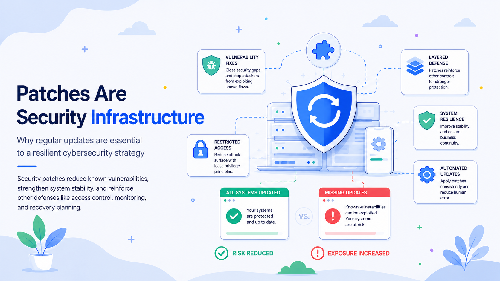

# Patches Are Security Infrastructure, Not Housekeeping

*Part 4 of a cybersecurity series on building systems that remain defensible under pressure*

A software update notification is easy to dismiss. It interrupts a meeting, delays a deployment, or asks for a restart at the least convenient moment. In many organizations, patching is still treated as background maintenance: necessary, repetitive, and mostly operational.

That view is incomplete.

Updates and patches are part of the security architecture. They remove known weaknesses, reduce attack paths, improve reliability, and help other controls work as designed. Patch management also connects technical maintenance with asset management, access control, network segmentation, monitoring, incident response, and business continuity.

NIST defines enterprise patch management as identifying, prioritizing, acquiring, installing, and verifying patches, updates, and upgrades. It frames patching as preventive maintenance and a necessary cost of operating technology—not optional cleanup.

Housekeeping makes an environment look orderly. Security maintenance changes the probability and impact of compromise.

## A Patch Closes More Than a Bug

Modern software combines operating-system services, firmware, drivers, APIs, cloud services, and third-party libraries. Even carefully engineered systems contain defects. Some cause crashes. Others let an attacker execute code, bypass authentication, expose data, escalate privileges, or disrupt service.

A security patch changes the affected component so a known weakness can no longer be exploited in the same way. Updates may also replace insecure defaults, strengthen cryptography, remove deprecated protocols, improve logging, or add protections that were absent when the product was released.

This creates three direct benefits.

First, patching reduces exposure to known vulnerabilities. Once a flaw is public, defenders and attackers can study the same information. Security teams receive remediation guidance, but adversaries gain a map of what to target. Delay creates a window in which an organization remains exposed to a known technique.

Second, updates improve resilience. A stable system is easier to defend than one suffering from compatibility failures, unsupported components, or unreliable monitoring agents. Operational instability can obscure malicious activity, create alert fatigue, or push teams to disable controls just to keep services running.

Third, patches prepare systems for emerging threats. Vendors harden products as attack methods change. Updating cannot stop every future attack, but it prevents the environment from remaining frozen at an older and increasingly predictable security baseline.

## The Real Risk Is Not “Unpatched”; It Is Unmanaged

“Just patch it” sounds simple. Enterprise environments are not. They include laptops, servers, containers, mobile devices, network appliances, identity platforms, SaaS products, and embedded software. Some systems are internet-facing. Others support critical operations and cannot be restarted without coordination. Updates may require prerequisites or introduce compatibility risk.

Effective patching is therefore a risk-management process, not a race to install every update immediately.

A mature program must know:

* what hardware, software, firmware, libraries, and services it operates;
* which assets are exposed, critical, or connected to sensitive data;
* which vulnerabilities are actively exploited;
* what controls reduce risk when a fix cannot be applied immediately;
* how a change will be tested, deployed, verified, and rolled back; and
* who owns the risk when remediation is delayed.

Inventory comes first. An organization cannot patch an asset it does not know exists, and it cannot prioritize a component it cannot associate with a business service. Endpoint platforms, cloud inventories, dependency scanners, configuration databases, and software bills of materials are security controls, not merely operational records.

Prioritization must also go beyond severity scores. A critical flaw in an isolated test system may present less immediate risk than a lower-scored vulnerability on an exposed identity gateway. CISA’s Known Exploited Vulnerabilities Catalog helps organizations prioritize flaws with evidence of exploitation in the wild, and CISA recommends using it in vulnerability-management decisions.

The objective is not perfect coverage at every moment. It is controlled exposure: knowing where gaps exist, reducing the most important risks first, and preventing exceptions from becoming permanent.

## Patching Is One Layer in a Larger Defense

No patch program replaces the rest of cybersecurity. A newly disclosed vulnerability may have no fix. An update may be delayed for operational reasons. An attacker may use stolen credentials rather than a software flaw. Security therefore depends on overlapping layers.

Patching strengthens those layers.

Least privilege limits what a compromised account or application can reach. A patch may prevent the initial exploit, while restricted access reduces damage if exploitation still occurs.

Segmentation separates systems into smaller trust zones. If an unpatched service is compromised, segmentation can stop the attacker from reaching unrelated databases, administrative interfaces, or backups.

Monitoring provides visibility while remediation is underway. Updated agents, logging components, inspection tools, and certificates are more likely to detect exploitation and unusual behavior.

Backups and recovery reduce impact. Patching lowers the probability that ransomware or destructive malware will succeed; tested recovery capabilities limit the consequences if prevention fails.

This is defense in depth in practical terms: designing controls so the failure of one does not become the failure of the entire environment.

## What Real Incidents Teach Us

The 2017 WannaCry outbreak showed how quickly a known weakness can be operationalized at scale. Microsoft had released the MS17-010 security update before the outbreak and later explained that WannaCrypt used an SMB exploit against machines that remained unpatched. Its worm-like behavior allowed it to spread between vulnerable systems, turning delayed maintenance into a network-wide event.

The lesson was broader than “install Windows updates.” Patching, legacy-system management, segmentation, inventory, and emergency response had to work together. A patched endpoint blocked the known exploit. Segmentation reduced propagation. Accurate inventory revealed unsupported systems.

The Equifax breach illustrates the same principle. A U.S. Government Accountability Office review found that an Apache Struts vulnerability was not properly identified on the company’s online dispute portal during patching. The report also described weaknesses involving detection, segmentation, and data governance. Attackers expanded beyond the initial application into additional databases, while an expired certificate prevented encrypted traffic from being inspected effectively.

The missing patch opened a path; incomplete identification, weak segmentation, ineffective monitoring, and excessive access increased the impact.

Log4Shell added another lesson: dependencies may be hidden. The critical Log4j vulnerability disclosed in 2021 affected a logging component embedded in many applications and products. Apache’s guidance documented affected versions, fixed versions, and cases in which an initial fix required further revision.

For many teams, the hardest question was not how to update Log4j, but where it existed. The incident exposed the limits of inventories that track applications but not their packaged libraries. Modern patch management must extend into software supply chains, build pipelines, container images, managed services, and vendor products.

## Building a Patch Program That Works

A sustainable program needs governance as much as tooling. Automation can deploy updates, but it cannot determine business criticality, approve downtime, resolve ownership disputes, or accept residual risk.

Start with a policy that defines scope, roles, timelines, exception handling, and evidence requirements. It should distinguish routine maintenance from emergency remediation and provide an escalation path for actively exploited vulnerabilities.

Every managed asset should have an owner, business purpose, support status, and update method. Unsupported systems should be upgraded, isolated, replaced, or explicitly accepted as risk. Unknown ownership is itself a security finding.

Prioritize patches using context: exploitation status, exposure, required privileges, data sensitivity, business impact, compensating controls, and recovery options. A standard deadline can guide normal operations, but active exploitation may require immediate action.

Testing should match the system. Critical services may need representative environments, backups, rollback plans, and scheduled change windows. Lower-risk endpoints may suit rapid automated deployment. Canary groups allow a small population to receive the update before broader rollout.

Verification is equally important. A console reporting “successful” does not prove that the vulnerable component was replaced, the system restarted, or an embedded library changed. Verification may require version checks, authenticated scans, configuration validation, and service telemetry.

Exceptions must expire. A delayed patch should record the reason, owner, compensating controls, review date, and remediation plan. An exception without an expiration date is deferred risk with no trigger for reconsideration.

Metrics should measure risk reduction rather than activity. “Ninety-five percent compliant” means little if the remaining five percent includes exposed identity servers. Useful measures include remediation time for actively exploited flaws, unsupported-system counts, exception age, failed deployments, and independently verified fixes. Compliance rates are only credible when the asset inventory is credible.

## The Future of Patching

Technology is changing the unit of maintenance. The traditional model assumed an application installed on a known machine. Modern environments are fluid: containers may exist for minutes, serverless functions depend on provider-managed runtimes, applications import hundreds of packages, and devices may contain firmware that cannot be updated remotely.

Patch management will increasingly become lifecycle management.

Software bills of materials and dependency intelligence will help locate vulnerable components inside applications. Build systems will rebuild and redeploy artifacts rather than modify them in place. Immutable infrastructure will replace outdated instances with known-good images. Cloud providers will automate parts of the underlying maintenance, while customers remain responsible for applications, identities, configurations, and data.

Artificial intelligence may improve triage by correlating exploit activity, asset context, and business impact. It may also help attackers convert disclosures into working exploits faster. This will compress remediation timelines and make manual, meeting-driven processes less viable.

Secure-by-design practices—safer defaults, sandboxing, automatic updates, memory-safe languages, and modular architectures—can make vulnerabilities harder to exploit and fixes easier to deploy. They will not eliminate maintenance. Every dependency has a lifecycle.

Organizations should design for updateability. Systems that cannot be inventoried, tested, upgraded, or replaced safely accumulate security debt from the moment they enter production.

## Final Thoughts: Maintenance Is a Security Capability

Patching is often invisible when it works. There is no dramatic incident or obvious return—only continued operation. That invisibility makes it easy to underfund.

A disciplined update program is nevertheless a clear sign of a mature security posture. It shows that an organization understands its environment, assigns ownership, evaluates risk, coordinates teams, validates changes, and learns from failures.

The useful questions are broader than “Are automatic updates enabled?”

Do we know what we operate? Can we find vulnerable dependencies quickly? Do we prioritize based on actual exposure? Can we deploy urgent fixes without losing control of production? Do we verify remediation? Are exceptions temporary and visible? Can we continue operating when a patch is unavailable?

Every organization will have gaps. The objective is continuous improvement: shorten discovery time, reduce unmanaged assets, make deployment safer, eliminate unsupported technology, and connect maintenance decisions to business risk.

Attackers need one usable path. Defenders need a process that repeatedly removes those paths before they become incidents. Updates and patches are not the whole cybersecurity strategy, but without them, every other control must defend weaknesses that are already known—and often already being exploited.
